Développements 2022 11
======================

Contexte
--------

Ce déploiement des développements en cours sur le logiciel EVA a eu lieu le 9/11/2022. Il comprend des résolutions d’anomalies, des améliorations ergonomiques, l’ajout de nouvelles fonctionnalités et une évolution pour conformité avec le cadre Open Source.

Les développements sont détaillés ci-après, avec le détail du ticket GitLab associé (il faut un compte pour le consulter) et un mode d’emploi pour les nouveautés.

Il y a deux points d’attention :
	* Le changement de la librairie des exports peut avoir un **impact sur les exports Word paramétrés**. Si vous êtes impactés, l’assistance saura vous aider.
	* La résolution des **envois d’alertes mails automatiques** : je vous invite à **vérifier les envois** de ces alertes et à me notifier si le problème persiste.

Anomalies résolues
------------------

1. Anomalie droit d’ajout des territoires
~~~~~~~~~~~~~~~~~~~~~~~~~~~~~~~~~~~~~~~~~
`Ticket 81 <https://gitlab.com/logiciel-eva/logiciel-eva/-/issues/81>`_ : Dans certains cas les utilisateurs ne parvenaient pas à renseigner des territoires dans les fiches. C’était une anomalie au niveau du rôle de l'utilisateur pour « Créer » des fiches : si ce droit était désactivé dans le rôle, il était impossible d'ajouter des territoires alors que la possibilité d’ajouter des territoires aurait dû être associée au droit de « Modifier » les fiches.

**Corrigé** : les utilisateurs qui ont le droit de modifier les fiches ont le droit d’ajouter des territoires

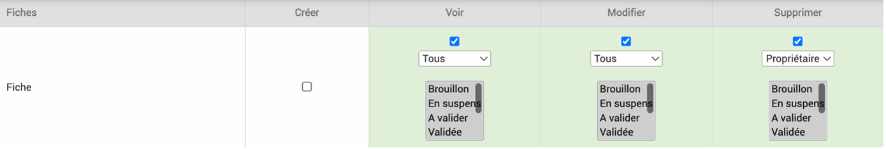

2. Envoi des alertes automatiques
~~~~~~~~~~~~~~~~~~~~~~~~~~~~~~~~~
`Ticket 163 <https://gitlab.com/logiciel-eva/logiciel-eva/-/issues/163>`_ : Les alertes automatiques n’étaient plus reçues car détectée comme suspectes par les gestionnaires de boîte mails.

**Corrigé** : les alertes de mail sont maintenant envoyées avec une adresse evaparc.net qui est configurée de manière à inspirer confiance aux gestionnaires de boîte mails. 

3. Affichage du module des mots clés 
~~~~~~~~~~~~~~~~~~~~~~~~~~~~~~~~~~~~
`Ticket 267 <https://gitlab.com/logiciel-eva/logiciel-eva/-/issues/267>`_ : Dans le module de définition des mots clés, la taille de la fenêtre n'était pas adaptée et il n'était pas possible de voir toutes les colonnes sans dézoomer. De plus, parfois les mots clés clignotaient et sautaient de ligne quand on essayait de cliquer dessus.

**Corrigé** : Il y a maintenant des ascenseurs verticaux et horizontaux pour pouvoir voir tous les mots clés et colonnes. L’affichage du nom complet a été bloqué pour éviter les clignotements.

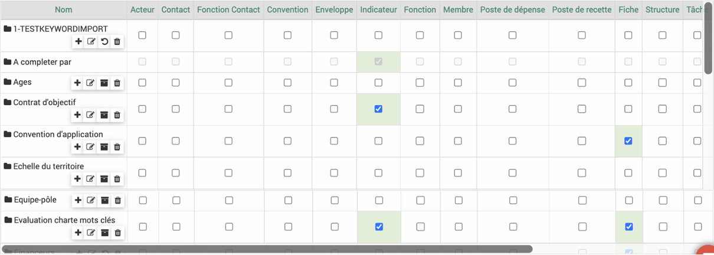

4. Titre de fiche long 
~~~~~~~~~~~~~~~~~~~~~~
`Ticket 270 <https://gitlab.com/logiciel-eva/logiciel-eva/-/issues/270>`_ : Lorsqu’un titre de fiche était trop long, il était chevauché par le statut et les notes, ce qui rendait le tout peu lisible.

**Corrigé** : Lorsque le titre est long, il s’adapte sur plusieurs lignes.

5. Navigation entre vue arborescente et vue liste
~~~~~~~~~~~~~~~~~~~~~~~~~~~~~~~~~~~~~~~~~~~~~~~~~
`Ticket 283 <https://gitlab.com/logiciel-eva/logiciel-eva/-/issues/283>`_ : Dans la partie « arborescence des fiches » dans le menu gauche des fiches, lorsque l’on cliquait sur « Vue liste », on était ensuite bloqué en vue liste sans pouvoir revenir en vue arborescente.

**Corrigé** : il y a maintenant un bouton « Vue arborescente » qui permet de faire l’aller-retour entre la vue arborescente et la vue liste.

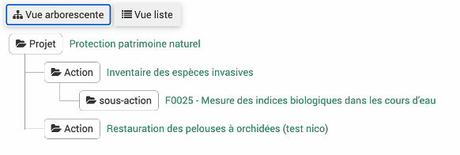

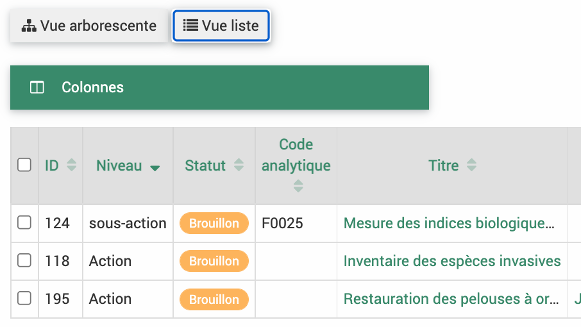

6. Anomalies sur les imports
~~~~~~~~~~~~~~~~~~~~~~~~~~~~
`Ticket 290 <https://gitlab.com/logiciel-eva/logiciel-eva/-/issues/290>`_ : 

* Import de contact : deux champs « Nom » étaient présents au moment de l’import des contacts mais seulement un fonctionnait. Le champ en plus est un champ nécessaire pour la base de données.

**Corrigé** : « Nom » a été remplacé par le champ « Nom-Prénom » qui n’est pas à utiliser.

.. image:: images/Nom_Prénom_import.png
   :width: 200

* Import d'utilisateur : le champ « Adresse email » était obligatoire dans le formulaire mais pas dans l’import ce qui pouvait poser problèmes lors de modification des utilisateurs. 

**Corrigé** : Il est maintenant obligatoire dans l’import également.

.. image:: images/Email_import.png
   :width: 200

* Import enveloppes : le champ financeur est obligatoire dans l’import mais il n’avait pas d’étoile.

**Corrigé** : Le champ financeur comporte une étoile (à noter qu’il faut indiquer l’ID du financeur et non le nom complet, cf Ticket #285 : Afficher et exporter la colonne ID)

.. image:: images/Financeur_import.png
   :width: 100

* Import budget recette : l’association à une enveloppe était obligatoire lors de la création d’un poste de recette mais pas lors de l’import (qui engendre la création de poste de recette).

**Corrigé** : l’association d’une enveloppe à un poste de recette a donc été rendu non-obligatoire partout.

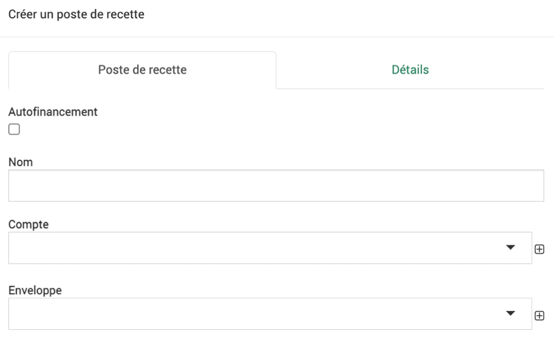

Améliorations ergonomiques
--------------------------

7. Nouvelles infobulles
~~~~~~~~~~~~~~~~~~~~~~~
`Ticket 279 <https://gitlab.com/logiciel-eva/logiciel-eva/-/issues/279>`_ et `Ticket 287 <https://gitlab.com/logiciel-eva/logiciel-eva/-/issues/287>`_ : De nouvelles infobulles ont été ajoutées pour faciliter l’utilisation du logiciel :

* Utilisateur inactif : dans le module utilisateur, la case « Inactif » est maintenant explicitée

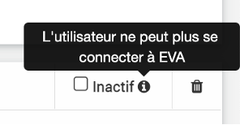

* Aide import : Une infobulle explique l’utilisation des boutons Envoyer, Valider et Importer et une infobulle dans le coin droit affiche les étapes pour l’import

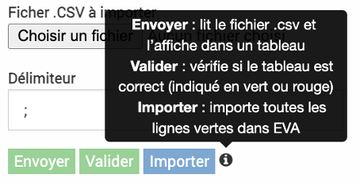

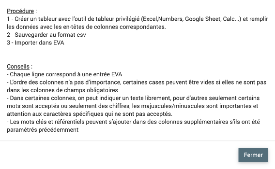

* Import budget avec écrasement : une infobulle prévient de la nécessité de remplir l’année (sinon l’import n’a pas lieu).

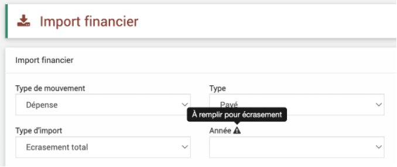

8. La taille des colonnes qui changent
~~~~~~~~~~~~~~~~~~~~~~~~~~~~~~~~~~~~~~
`Ticket 280 <https://gitlab.com/logiciel-eva/logiciel-eva/-/issues/280>`_ : Si la taille des colonnes qui changent au passage de la souris vous déplaît, vous pouvez maintenant éviter ce comportement en décochant la case « tableau redimensionnable » dans votre profil. Cette case, disponible avant dans un onglet difficilement trouvable, a été rapatriée à côté de votre choix de couleur et agrémentée d’une infobulle (cliquer sur votre nom en haut à droite dans EVA pour y accéder).

.. image:: images/Taille_colonnes.png
   :width: 600

9. Indicattion des filtres par défaut
~~~~~~~~~~~~~~~~~~~~~~~~~~~~~~~~~~~~~
`Ticket 281 <https://gitlab.com/logiciel-eva/logiciel-eva/-/issues/281>`_ : Dans certains modules des filtres par défaut sont appliqués sur les tableaux, ce qui parfois conduit à l’affichage d’aucune donnée. Ces filtres sont maintenant indiqués de manière évidente en haut des tableaux pour éviter les confusions.

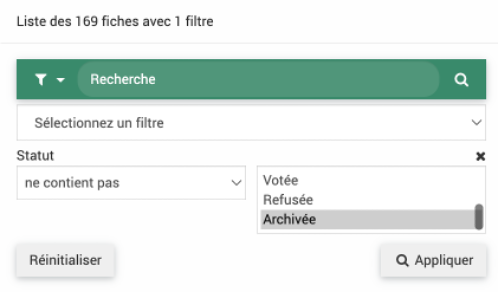

Nouvelles fonctionnalités !
---------------------------

10. Permettre les caractères spéciaux dans les titres
~~~~~~~~~~~~~~~~~~~~~~~~~~~~~~~~~~~~~~~~~~~~~~~~~~~~~
`Ticket 282 <https://gitlab.com/logiciel-eva/logiciel-eva/-/issues/282>`_ : Parfois lors de l’ajout de fiches et de liaisons avec des fiches de temps, des caractères spéciaux comme les guillemets, les points de suspensions ou les crochets dans les titres pouvaient conduire à un bug. Ce n’est plus le cas, les ‘, ‘’, … et [ ] sont maintenant autorisés mais attention à l’utilisation des crochets si ce sont vos caractères d’entourage pour la liaison des temps.

11. Afficher et exporter la colonne ID
~~~~~~~~~~~~~~~~~~~~~~~~~~~~~~~~~~~~~~
`Ticket 285 <https://gitlab.com/logiciel-eva/logiciel-eva/-/issues/285>`_ : Les imports requièrent parfois la référence présente en base de données et dans l’URL qu’il est compliqué de trouver (ID). Elle est maintenant présente dans tous les tableaux. Elle est unique et non modifiable.

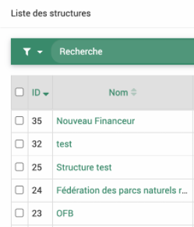

12. Import des mots clés et référentiels via csv
~~~~~~~~~~~~~~~~~~~~~~~~~~~~~~~~~~~~~~~~~~~~~~~~
`Ticket 286 <https://gitlab.com/logiciel-eva/logiciel-eva/-/issues/286>`_ : Pour faciliter la création des nouveaux mots clés et référentiels, une fonction d’import en csv est maintenant disponible comme dans les autres modules. Le bouton rouge en bas à droite permet d’importer les mots clés ou référentiels. 
Cette fonctionnalité est documentée dans la partie import des :ref:`Fonctionnalités générales`

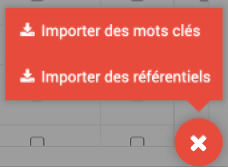

13. Import des équipes et acteurs dans les fiches
~~~~~~~~~~~~~~~~~~~~~~~~~~~~~~~~~~~~~~~~~~~~~~~~~
`Ticket 289 <https://gitlab.com/logiciel-eva/logiciel-eva/-/issues/289>`_ : Lors de l’import des fiches, il est maintenant possible d’importer les membres de l’équipes (autres que chef d’équipe et validateur) ainsi que les acteurs associés à la fiche. Ils peuvent être ajoutés avec leur rôle. 
Cette fonctionnalité est documentée dans la partie import des :ref:`Fonctionnalités générales`

Conformité Open Source
----------------------

14. Changement de la librairie d'export
~~~~~~~~~~~~~~~~~~~~~~~~~~~~~~~~~~~~~~~
`Ticket 265 <https://gitlab.com/logiciel-eva/logiciel-eva/-/issues/265>`_ : La librairie qui couvrait les exports dans EVA (PHPDocx) venait d’une licence propriétaire, ce qui était contraire à la logique d’EVA qui est passé en Open Source cette année. Nous avons donc changé cette librairie pour une librairie en Open Source PHPOffice. Nous avons tout fait pour qu’il y ait le moins de perturbations possibles mais certains exports word seront potentiellement à retravailler (surtout s’il y a eu des modifications dans le code html). Si vous constatez des problèmes sur vos exports Word, je vous invite à contacter l’assistance qui pourra les corriger.

