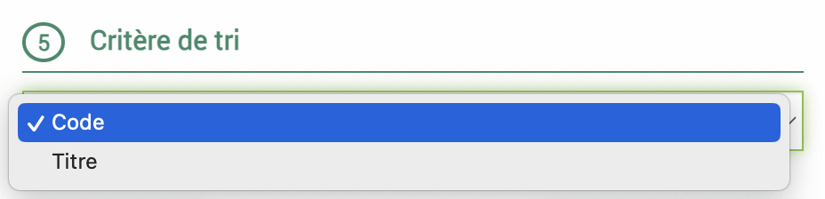
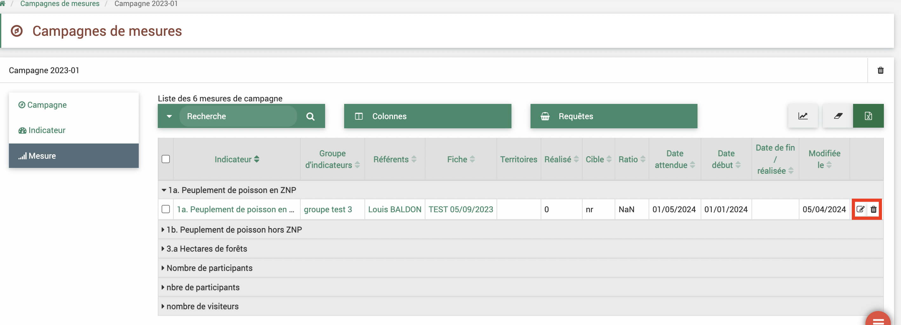

.. include:: ../../substitutions.rst
Développements 2024 08
======================

Contexte
--------

Un déploiement des derniers développements sur le logiciel EVA a eu lieu le 12/08/2024. Il comprend des **résolutions d’anomalies**, des corrections sur les **nouvelles fonctionnalités pour les indicateurs** et leurs analyses et des **améliorations des fonctionnalités existantes**.

Les développements sont détaillés ci-après, avec le détail du ticket GitLab associé et un mode d’emploi pour les nouveautés.

**ATTENTION CONCERNANT LE MODULE INDICATEUR IL RESTE DES ANOMALIES SUR LA MODIFICATION DES DATES. NE PAS UTILISER LES ANALYSES INDICATEURS POUR L'INSTANT !!!!**

Nouvelles fonctionnalités indicateurs
#####################################

Une première partie des développements sur le module indicateur a été livrée en avril 2024 incluant :

- groupement des indicateurs en "groupe" 
- création de campagne de recueil des donnnées pour associer une date de saisie attendue et un référent par indicateur
- import des mesures d'indicateur
- association de pièce-jointes aux mesures

La deuxième partie du développement du module indicateurs devait concerner des corrections et améliorations de ces fonctionnalités et les adapter aux analyses.

Détails du précédent déploiement dans la `documentation dédiée <https://documentation-eva.readthedocs.io/fr/latest/D%C3%A9veloppements/D%C3%A9veloppements-2024-04/index.html#fonctionnalites-indicateurs>`_

**N'hésitez pas à me faire remonter toutes remarques ou anomalies sur ces nouvelles fonctionnalités indicateurs par mail lroumazeilles@parcs-naturels-regionaux.fr**

**ATTENTION CONCERNANT LE MODULE INDICATEUR IL RESTE DES ANOMALIES SUR LA MODIFICATION DES DATES. NE PAS UTILISER LES ANALYSES INDICATEURS POUR L'INSTANT !!!!**

.. warning::
   Pour l'instant, il faut faire attention lors de la modification de mesure de campagnes hors des campagnes (fiches et indicateurs). Car dans les campagnes, les mesures "cibles" et "réalisées" sont regroupées mais elles ne le sont pas dans les autres modules (indicateurs et fiches). Donc les champs dates, commentaires et sources sont unifiés dans les campagnes mais dans les autres modules. Si on remplit les champs commentaires, sources ou dates dans les mesures indicateurs avec des données différentes entre cible et réalisé, puis on modifie la mesure dans la campagne, les données vont être unifiées sur les deux lignes et donc il y a une modification non voulue par l'utilisateur qui peut faire perdre des informations. Pareil pour les suppressions de mesures cibles ou réalisées hors module campagne qui conduiront à la suppression du couple cible/réalisé dans la campagne mais en laisseront un présent hors campagne.

Anomalies résolues
------------------

1. Import pièce-jointe convention
#################################

`Ticket 626 <https://gitlab.com/logiciel-eva/logiciel-eva/-/issues/626>`_
Le bouton d'ajout de pièce-jointe était devenu inactif dans les conventions.

**Corrigé**

2. Ordre d'affichage dans le menu arborescent
#############################################

`Ticket 407 <https://gitlab.com/logiciel-eva/logiciel-eva/-/issues/407>`_

Depuis le module arborescent des fiches, on peut choisir de trier les fiches selon l'ordre des codes ou des titres.

Mais il y avait une anomalie dans l'organisation des sous-fiches. EVA organisait les fiches de deux façons dans l’arborescence en fonction de leur niveau :

- Lorsque les fiches crées sont rattachées au référentiel directement, donc des fiches de niveau 0 qui ne sont pas enfants d’autres fiches dans ce référentiel, alors les fiches sont affichées par ordre alphabétique du code (ce qui est le comportement recherché)

- Lorsque les fiches sont rattachées à une autre fiche présente dans ce référentiel (niveau 1 et au-dessus) alors elles sont affichées par ordre de création et non plus par ordre alphabétique.

**Corrigé : les sous-fiches sont maintenant affichées par ordre alphabetique également**

3. Gestion des rôles pour la GBCP
#################################

`Ticket 548 <https://gitlab.com/logiciel-eva/logiciel-eva/-/issues/548>`_
Pour certains comptes parcs (principalement PNX et PNM), le module budget affichait les éléments de la GBCP (destination, organisation, nature) mais on ne pouvait plus les cacher via les rôles, les lignes de "nature", "organisation", "destination" n'apparaissent plus dans les rôles.

**Corrigé pour la gestion des rôles et désactivation de l'option GBCP si non nécessaire**

Fonctionnalités indicateurs
---------------------------

**ATTENTION CONCERNANT LE MODULE INDICATEUR IL RESTE DES ANOMALIES SUR LA MODIFICATION DES DATES. NE PAS UTILISER LES ANALYSES INDICATEURS POUR L'INSTANT !!!!**

1. Corrections
##############

`Ticket 553 <https://gitlab.com/logiciel-eva/logiciel-eva/-/issues/553>`_
La suppression des groupes d'indicateurs ne fonctionnait pas et le stylo dans les lignes s'affichaient alors que l'on ne pouvait pas éditer.

**Corrigé : la supression est possible et le stylo ne s'affiche plus**

`Ticket 555 <https://gitlab.com/logiciel-eva/logiciel-eva/-/issues/555>`_
On ne pouvait pas ajouter plusieurs documents d'un coup dans une mesure.

**Corrigé : l'ajout des documents dans les mesures est rendu plus ergonomique**

`Ticket 586 <https://gitlab.com/logiciel-eva/logiciel-eva/-/issues/586>`_
Dans les campagnes :

- Le bouton de suppression de la campagne en fin de ligne dans le tableau des campagnes ne fonctionnait pas
- Dans le tableau indicateurs de campagne, la suppression et modification des indicateurs (référents et occurrence) n'était pas possible

**Corrigé**

`Ticket 589 <https://gitlab.com/logiciel-eva/logiciel-eva/-/issues/589>`_
Pour les mesures de campagnes :

- quand une mesure n'est pas rempli elle doit indiquer "nr". Cependant, quand on vidait une valeur de mseure via la modification de la ligne dans la campagne, elle indiquait 0 au lieu de "nr"
- il n'était pas possible de modifier ou supprimer les mesures en fin de ligne

**Corrigé**

`Ticket 579 <https://gitlab.com/logiciel-eva/logiciel-eva/-/issues/579>`_
Avec les nouvelles fonctionnalités, les parcs peuvent remplir leurs mesures via les campagnes. Cependant, ces mesures devenaient non accessibles dans les instances réseaux même sur des indicateurs réseaux.

**Ceci a été partiellement corrigé mais des dernières corrections sont à venir**

Améliorations des fonctionnalités existantes
--------------------------------------------

1. Améliorations analyse budget
###############################

`Ticket 599 <https://gitlab.com/logiciel-eva/logiciel-eva/-/issues/599>`_ et `Ticket 580 <https://gitlab.com/logiciel-eva/logiciel-eva/-/issues/580>`_ 
Pour les mots-clés créés spécifiquement pour les dépenses et recettes :

- les faire apparaître dans les colonnes du module Analyses budget et dans les exports
- les faire apparaître dans les colonnes de l'onglet budget des fiches et dans les exports
- pour les mots-clés réseaux en filtre dans les analyses budget
- pour les mots-clés réseaux le remplissage possible via l'import

**Ceci a été mis en oeuvre**

2. Retrait de la fonctionnalité de champs obligatoires qui était dysfonctionnelle
#################################################################################

`Ticket 451 <https://gitlab.com/logiciel-eva/logiciel-eva/-/issues/451>`_

Il était possible de créer des champs personnalisables dont le remplissage était obligatoire. Lorsque ces champs étaient ajoutés à un modèle de fiche en particulier cela entraînaient des messages d'erreur dans les autres modèles de fiche également qui signalaient qu'un champ obligatoire n'avait pas été rempli bien que ce champ n'apparaisse pas dans ce modèle et cela bloquait l'enregistrement de la fiche.

**Attention si certains de vos champs étaient obligatoires, vous devez maintenant solliciter l'assistance pour les rendre non-obligatoire**

3. Colonnes annuaires supplémentaires
#####################################

`Ticket 485 <https://gitlab.com/logiciel-eva/logiciel-eva/-/issues/485>`_

Les champs personnalisables dans le module annuaire sont maintenant accessibles dans les colonnes. Cela permet d'exporter toutes les données annuaires dont les consentements par exemple.

4. Colonnes utilisateurs des synchronisations de temps
######################################################

`Ticket 608 <https://gitlab.com/logiciel-eva/logiciel-eva/-/issues/608>`_

Il y a eu un ajout de colonnes reprenant le nom des utilisateurs et la date de dernière synchronisation dans les colonnes du module de synchronisation afin d'avoir une meilleure vision sur les synchronisations des différents agents des parcs |temps| > |synchro_module|

Une deuxième étape de développement visera à bien traduire les ID des utilisateurs en nom et à pouvoir filtrer sur le champ utilisateurs.

5. Case accès réseau accessible sous tous les statuts
#####################################################

`Ticket 423 <https://gitlab.com/logiciel-eva/logiciel-eva/-/issues/423>`_

Quand on change un statut de fiche de "Brouillon" à "A valider", "validée" ou "votée", la partie principale de la fiche devient non modifiable ce qui bloquait aussi la case à cocher "accessible réseau".
Pour permettre de cocher cette case une fois la fiche validée, elle a été dissociée des blocages de statut.

