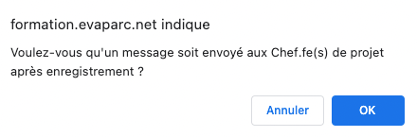
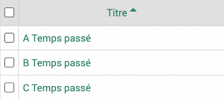
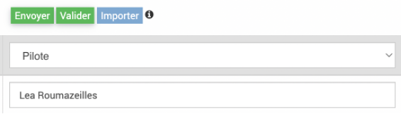
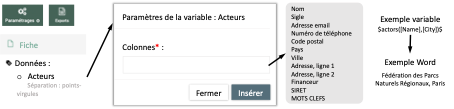
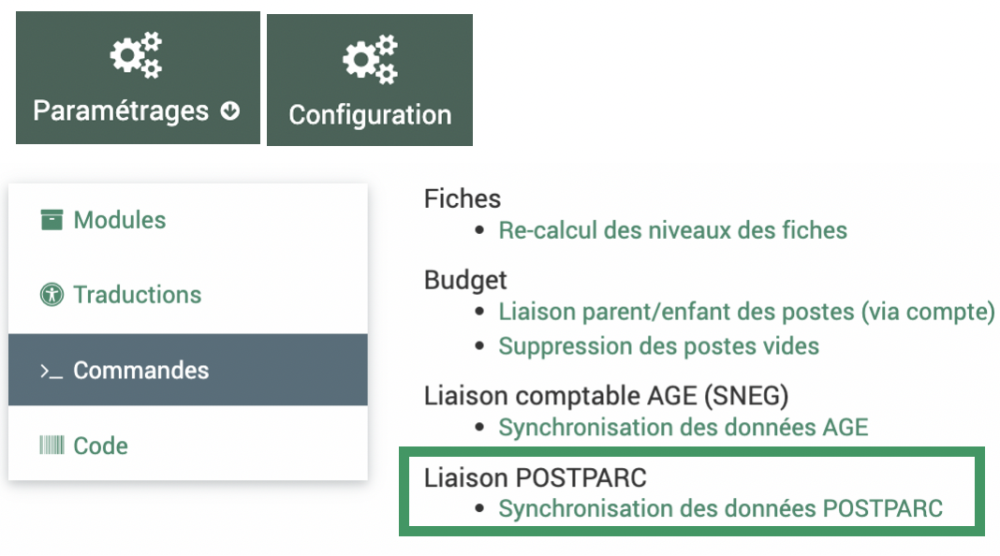

Développements Mars 2023
========================

Contexte
~~~~~~~~

Un déploiement des derniers développements sur le logiciel EVA aura lieu le 1er Mars après 17h. Il comprend des **résolutions d’anomalies**, des **améliorations des fonctionnalités d’import et d’export, l’ajout de nouvelles fonctionnalités dans l’annuaire et les conventions** et une **nouvelle liaison automatique** avec le logiciel de gestion de contact PostParc.

Les développements sont détaillés ci-après, avec le détail du ticket GitLab associé (il faut un compte pour le consulter) et un mode d’emploi pour les nouveautés.

Anomalies résolues
~~~~~~~~~~~~~~~~~~

1. Anomalie sur les filtres des analyses temps
##############################################
`Ticket 239 <https://gitlab.com/logiciel-eva/logiciel-eva/-/issues/239>`_ : 
Les filtres et requêtes dans les analyses des feuilles de temps présentaient quelques anomalies : 
- Les requêtes enregistrées ne s’affichaient pas correctement
- Quand on appliquait une requête puis un filtre la combinaison ne s’effectuait pas correctement

**Corrigé** : les filtres des requêtes enregistrées s’affichent correctement (sauf pour le critère « utilisateur courant » qui a toujours des soucis d’affichage) et la combinaison requêtes et fiches supplémentaires est possible

2. Notification mails du changement de statut
#############################################
`Ticket 345 <https://gitlab.com/logiciel-eva/logiciel-eva/-/issues/345>`_ : Les mails automatiques envoyés lorsque l’on change certains statuts de fiches ne fonctionnaient plus.

**Corrigé** : les mails automatiques repartent bien quand on change le statut pour « À valider » ou « Validée ».

3. Tri alphabétique des colonnes
################################
`Ticket 266 <https://gitlab.com/logiciel-eva/logiciel-eva/-/issues/266>`_ : Les flèches des colonnes qui permettent de réordonner les lignes ne le faisait pas forcément par ordre alphabétique, particulière si les lignes contenaient des chiffres ou des espaces et ceux dans plusieurs modules.

**Corrigé** : Ce tri a été corrigé pour :
- Colonne noms dans module conventions
- Colonne structures dans fiche > acteurs
- Colonnes titre et utilisateur dans fiches > temps passé
- Colonnes titre et fiches dans temps > liste > vue liste
- Colonne titre dans temps > synchro
- Colonne titre dans fiche > avancement
- Colonnes titre et fiche dans tâches

Améliorations des fonctionnalités d'import et d'export
~~~~~~~~~~~~~~~~~~~~~~~~~~~~~~~~~~~~~~~~~~~~~~~~~~~~~~

4. Imports de civilités contacts
################################
`Ticket 288 <https://gitlab.com/logiciel-eva/logiciel-eva/-/issues/288>`_ : Le format des imports de civilités de contacts n’était pas le même que pour les utilisateurs ce qui pouvait porter à confusion et mener à des anomalies d’affichage.

**Corrigé** : Les imports des civilités des contacts peuvent maintenant s’effectuer de la même façon que pour les utilisateurs avec les variables M. et Mme. Ils sont bien affichés dans le tableau.

5. Import du lien entre contact et structure
############################################
`Ticket 305 <https://gitlab.com/logiciel-eva/logiciel-eva/-/issues/305>`_ : L’import de plusieurs contacts et structures en un seul import était possible mais la liaison entre les contacts et structures était ensuite fastidieuse à effectuer car il n’était pas possible de l’importer donc il fallait ouvrir chaque contact ou structure.

**Corrigé** : Il est maintenant possible d’importer cette liaison entre contact et structure qui s’effectue par la fonction.

Mode d'emploi dans la documentation.

6. Amélioration du lien entre export et import tableur
######################################################
`Ticket 308 <https://gitlab.com/logiciel-eva/logiciel-eva/-/issues/308>`_ 

**Export :**
- Annuaire -> Structures : les colonnes SIRET et Site web sont maintenant exportables
- Fiches : la colonne ID modèle de fiche a été rajoutée dans l’export car cet ID est utile pour l’import des fiches
- Budget -> Enveloppe : la colonne ID financeur a été rajoutée dans l’export car cet ID est utile pour l’import des enveloppes
- Budget -> Compte : la colonne type de mouvement a été rajouté et est exportable pour permettre de faire la différence à l’export entre les dépenses et les recettes

**Import :**
- Fiches : les variables Chefs de projet ou Validateur qui sont nommées par défaut dans le logiciel ont pu être renommées pour le parc en Pilote par exemple pour Chef de projet. Dans ce cas, l’import permet maintenant d’indiquer le nouveau terme.

7. Amélioration des exports et imports des conventions et acteurs
#################################################################
`Ticket 307 <https://gitlab.com/logiciel-eva/logiciel-eva/-/issues/307>`_ 

**Export Word :**
- Convention : les champs de la convention sont maintenant exportables sous forme de variable via l’export des fiches

Attention, avec la variable « Mots-clés », tous les mots clés rattachés à la convention sont exportés sans distinction possible.

.. image:: images/export_convention.png
   :width: 600

- Acteurs : les champs des acteurs sont maintenant exportables sous forme de variable via l’export des fiches

**Export Excel :**
- Convention : les colonnes Description, ID contractant, Membres, Territoire, Fiches, ID fiches peuvent maintenant être affichées à l’écran et exportées

**Import csv :**
- Convention : il est maintenant possible d’importer les contractant par ID et d’importer les fiches (par ID) rattachées à la convention. Les fiches rattachées en import seront affectées automatiquement à 100% à la convention. Pour rattacher plusieurs fiches, il faut indiquer dans la colonne ID Fiches ID1 -- ID2 (deux ID séparés par deux tirets et un espace de chaque côté des tirets).

Nouvelles fonctionnalités !
~~~~~~~~~~~~~~~~~~~~~~~~~~~

8. Convention
#############
`Ticket 306 <https://gitlab.com/logiciel-eva/logiciel-eva/-/issues/306>`_ : Les conventions sont maintenant duplicables. 

Mode d’emploi dans la documentation.

9. Annuaire
###########
`Ticket 299 <https://gitlab.com/logiciel-eva/logiciel-eva/-/issues/299>`_ : 

- La recherche de doublons est désormais disponible dans le module annuaire.
- La fusion est désormais possible dans l’annuaire. 
- Il est désormais possible d’ajouter un champ personnalisable dans les structures (comme dans fiches et contact).
- Civilité non binaire

Mode d'emploi dans la documentation.

Liaison logiciel PostParc
~~~~~~~~~~~~~~~~~~~~~~~~~

10. Liaison automatique avec le logiciel PostParc
#################################################
`Ticket 316 <https://gitlab.com/logiciel-eva/logiciel-eva/-/issues/316>`_ : La liaison automatique entre l’annuaire et le logiciel PostParc (https://www.postparc.fr/)  est désormais possible. 
Pour l’utiliser, il faut : 

- avoir un compte postparc
- demander un compte API aupres de l'équipe de POSTPARC (PROBESYS)
- demander le raccordement par l’assistance qui doit se faire en base de données.

Caractéristiques de la liaison :

- Toutes les données des structures et contacts remontent automatiquement de PostParc à EVA (et seulement dans ce sens) ainsi que les rattachements contact-structures. 
- La case financeur est cochée « non » par défaut, la fonction de rattachement contact-structure si elle n’a pas été définie dans PostParc sera « membre » par défaut. 
- Une colonne « IMPORT POSTPARC » indique si le contact ou la structure a été importée de PostParc « SYNC-POSTPARC », supprimé dans PostParc « SUPP-POSTPARC », s’il a été créé dans EVA cette colonne sera vide. Ainsi si un contact a été supprimé dans PostParc, il ne sera pas supprimé automatiquement dans EVA pour éviter des pertes de données.
- L’appartenance des structures à des groupes et types d’organisme définis dans PostParc remontent dans les mots clés, ces mots clés ne sont pas administrables dans EVA, ils n’apparaissent pas dans les mots clés de l’administration EVA mais ils peuvent être utilisés en filtres comme les autres mots clés.
- L’appartenance des contacts à des groupes fonctionne comme pour les structures.
- La synchronisation automatique s’effectue tous les dimanches matins. Dans Paramétrages/Administration -> Configuration, onglet Commandes vous pouvez lancer la synchronisation manuellement.

