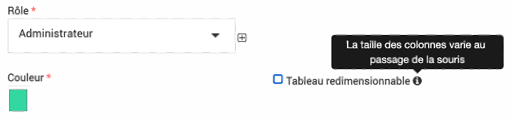

.. include:: ../substitutions.rst
FAQ
===

*Une question ? Envoyer moi un mail (lroumazeilles[at]parcs-naturels-regionaux.fr) ou solliciter l'assistance, je rajouterai la réponse à votre question dans cette liste.*

Taille des colonnes
-------------------
La largeur des colonnes peut soit être figée soit s'adapter lorsque l'on passe la souris dessus. C'est un paramétrage pour le profil de chaque personne, il faut cocher ou déchocher la case « tableau redimensionnable » dans votre profil. Elle se trouve à côté de votre choix de couleur. Vous pouvez cliquer sur votre nom en haut à droite dans EVA pour y accéder.

Problème d'accès, roue qui mouline
----------------------------------
Lorsque vous êtes face à une roue qui mouline indéfiniement ou n'avez plus accès à un module pour lequel vous aviez accès précédemment, deux explications sont fréquentes:

- la définition du rôle utilisateur a été modifiée : sur certains rôles il y a des dépendances pas toujours logiques qui vont empêcher les accès (nous sommes en train de corriger ces éléments) -> il faudra donc vérifier les rôles

- il y a un ancien filtre ou un tri de colonne qui bloquent : dans ce cas enlever tous les filtres ou réinitialiser les colonnes (en cliquant sur les petites flèches à côté du nom des colonnes)

Liste des territoires
---------------------
Dans une fiche, dans l'onglet territoire, en cliquant sur le petit plus la liste des territoires n'apparait pas, ceci est normal. Il faut taper au moins deux lettres puis la loupe et les territoires correspondants pourront s'afficher. Sinon, directement dans la zone de texte intial, en commençant à taper le nom de votre territoire, l'autocomplétion pourra avoir lieu.

Différence entre référentiels et mots clés
------------------------------------------
Techniquement les référentiels et mots clés sont la même chose (possibilité d’arborescence, de rattachement...).

- **Les référentiels** vont correspondre aux arborescences de type contractuel la charte ou le plan de gestion, ils sont rattachés automatiquement aux fiches et indicateurs.

- **Les mots clés** sont à définir plus finement pour les analyses et à rattacher à chaque type d’information.

Différence entre modèles de fiche et niveaux de fiches
------------------------------------------------------
Les modèles et niveaux sont dissociés dans les fiches EVA, un modèle ne s’applique pas automatiquement à un niveau.

- **Modèles de fiches** : Les modèles permettent de choisir le contenu à saisir pour certains types de projet et non pour d’autres. Par exemple des champs spécifiques pour les fiches Natura 2000 qui ne seront pas dans les fiches par défaut. Ils sont paramétrables dans la partie administration

- **Niveaux de fiches** : Les niveaux de fiche s’appliquent automatiquement en fonction du rattachement à un parent fiche (rattachement arborescence initiale dans la fiche). Par exemple si on a des niveaux tels que : Projet > Action > Sous-action. Une fiche créée sera par défaut un projet, elle deviendra une action si elle est rattachée à une fiche projet.

Rattachement d'une fiche à plusieurs mesures
--------------------------------------------
Si on rattache une fiche à plusieurs mesures, comment les éléments sont-ils comptabilisés ? Par exemple si on a une fiche avec un budget à 10 000 euros rattachés à deux mesures de la charte, dans les analyses comment est comptabilisé le budget pour chaque mesure ?

Par défaut les éléments vont être répétés dans les deux mesures, donc les 10 000 euros sont comptabilisés deux fois, pour bien faire apparaître les proportions. Par contre dans les totaux, on ne les comptabilise pas deux fois.

Lors de certaines analyses, il y a la possibilité de diviser les éléments à parité lorsqu’ils sont rattachés à plusieurs entités d’un référentiel (dans l’exemple attribuer 5 000 euros à chaque mesure), il faut cocher une case pour l’indiquer.

Suppression impossible
----------------------
La suppression d'un élément (requête, mots clés...) est parfois impossible même si l'on a les droits, une erreur (cadre rouge) est générée. 

Si l'erreur mentionne quelque chose comme : *"An exception occurred while executing [...] Integrity constraint violation: [...] Cannot delete or update a parent row: a foreign key constraint fails..."* Cela veut dire que l'élément est utilisé quelque part dans le logiciel donc il y a une sécurité pour éviter de supprimer l'élément. 

Par exemple une requête peut être associée pour un affichage de l'accueil ou dans une alerte. Un mot clé ou référentiel peut être rattaché à une fiche, indicateur ou d'autres éléments.

Il faudra donc supprimer les associations à l'élément que vous souhaitez supprimer pour que la suppression puisse avoir lieu. Pour les mots clés et référentiels, par sécurité s'ils ont été utilisés et même s'ils ne le sont plus, on ne pourra pas les supprimer, par contre ils peuvent être archivés ou vous pouvez demander à l'assistance de les supprimer si besoin.

Rôle d'accès, Rôle dans la fiche, Fonction, quelle différence ?
---------------------------------------------------------------
Plusieurs éléments du logiciel peuvent s'appeler Rôle mais avoir une fonctionnalité différente.

Les **rôles d'accès** tel que définis dans le module d'admninistration |roles| sont détaillés `ici <https://documentation-eva.readthedocs.io/fr/latest/Param%C3%A9trages-essentiels/index.html#gestion-des-roles>`_
Ce type de rôle permet de définir les accès au logiciel EVA. Vous pouvez par exemple définir un rôle d'accès "Administrateur" avec les droits ouverts pour créer, modifier, supprimer et voir tous les modules et un autre rôle d'accès "Utilisateur" avec les droits ouverts pour créer, modifier et voir la plupart des modules sauf l'administration par exemple et un rôle "Visiteur" avec les droits pour voir seulement le logiciel.
Ces rôles sont à rattacher à l'utilisateur dans le module |administration| > |utilisateurs|. On peut associer plusieurs personnes au même rôle.

Les **rôles des membres de la fiche** apparaissent dans la fiche dans le sous-onglet équipe. Si vous avez définit un mot-clé rattaché à membre (cf la partie sur les `mots clés <https://documentation-eva.readthedocs.io/fr/latest/Param%C3%A9trages-essentiels/index.html#onglet-mots-cles>`_)
lors de l'ajout d'un membre, vous pourrait ajouter un rôle qui apparaîtra dans la colonne rôle ici (sauf si ce membre est déjà un chef de projet ou un validateur). Si le mot-clé n'est pas rempli le rôle sera "membre" par défaut. Ce rôle peut être différent d'une fiche à l'autre pour la même personne.
Ces rôles n'ont pas lien avec les rôles d'accès décrit ci-dessus, ce sont simplement des termes définit par le référent EVA pour qualifier le rôle du membre de l'équipe dans le projet à des fins d'analyse plus tard. Ce rôle ne définit donc pas les droits d'accès à EVA.

La **fonction** dans le parc peut être définie dans les mots clés associés aux utilisateurs. Par exemple : chargé de mission, directeur, agent de terrain, stagiaire, élus...
Ces mots clés fonction sont à rattacher à l'utilisateur car cette fonction ne change pas d'un projet à l'autre comme le font les rôles des membres de fiche. Ils ne correspondent pas non plus au rôle qui définit les droits d'accès.

Exemple : 

- On peut avoir un utilisateur qui a la **fonction** de "chargé de mission" (fonction qui est rattachée à son profil), un **rôle dans une fiche** de "coordinateur" et de "chef de projet" dans une autre (rôle rattaché à la fiche) et un **rôle d'accès** d'utilisateur qui restreint ces droits de suppression.

- Un autre utilisateur peut avoir la fonction de directeur, un rôle de chef de projet dans les fiches, et un rôle d'accès administrateur.

- Un troisième utilisateur peut avoir la fonction d'élus, aucun rôle dans les fiches et un rôle d'accès "Visiteur".

- Le référent EVA peut avoir une fonction de chargé de mission, un rôle différent dans chaque fiche et un rôle d'accès administrateur.

Pour résumer :

+----------+----------------+----------------+-----------------------------------------------------------------------------+
| Type     | Usage          | À définir dans | Attribution                                                                 |
+==========+================+================+=============================================================================+
| Rôle     | Définit les    | Module         | Un même rôle peut être attribué à plusieurs utilisateurs                    | 
|          |                |                |                                                                             |  
|          | droits d'accès |                | Un même utilisateur n'a qu'un rôle                                          |
|          |                |                |                                                                             |
| d'accès  | au logiciel    | rôle           | Rôle à attribuer dans le module utilisateurs                                |
+----------+----------------+----------------+-----------------------------------------------------------------------------+
| Rôle     | Définit le     | Mots-clés      | Un même rôle peut ête attribué à plusieurs membres                          |
|          |                |                |                                                                             |
| dans une | rôle dans      | associé aux    | Un même utilisateur peut avoir des rôles différents dans différentes fiches |
|          |                |                |                                                                             |
| fiche    | un projet      | membres        | Rôle à attribuer dans l'onglet équipe des fiches                            |
+----------+----------------+----------------+-----------------------------------------------------------------------------+
| Fonction | Définit la     | Mots-clés      | Une même fonction peut être attribuer à plusieurs utilisateurs              |
|          |                |                |                                                                             |
| dans le  | fonction au    | associé aux    | Un même utilisateur peut avoir une ou plusieurs fonction                    |
|          |                |                |                                                                             |
| parc     | sein du parc   | utilisateurs   | Fonction à attribuer dans le module utilisateurs                            |
+----------+----------------+----------------+-----------------------------------------------------------------------------+

