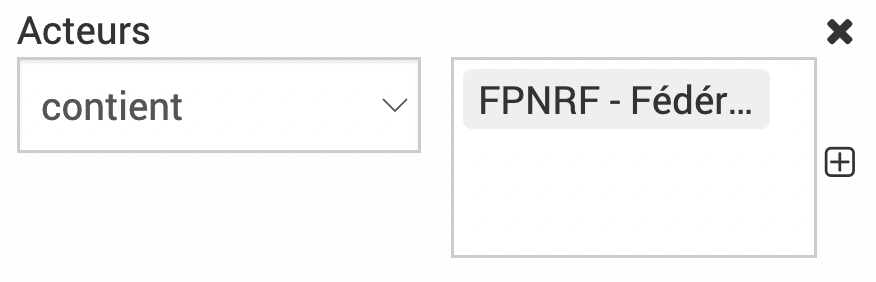
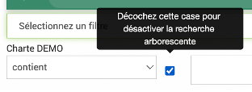
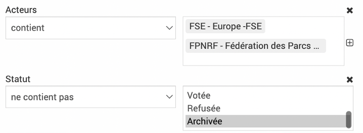
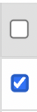

.. include:: ../substitutions.rst
Tableaux
--------

Les données sont représentées dans EVA sous forme de tableaux, chaque ligne représentant une entrée et chaque colonne une caractéristique.

Généralités
~~~~~~~~~~~

* Les entrées en **vert** sont cliquables, elles renvoient vers la page associée.

* Le crayon |crayon_modif_ligne| s'affiche dans certaines cases pour modifier directement dans le tableau, ne pas oublier d'enregistrer les modifications à la fin de la ligne |enregistrer_ligne| ou cliquer sur |croix_ligne| pour annuler. Cela permet d'éditer plus facilement le tableau si besoin d'éditer plusieurs lignes : il faudra éditer chaque ligne l'une après l'autre mais au moins cela permet de ne pas avoir à rentrer dans l'élément à chaque fois et rester en vue tableau.

* Des outils sont présents en fin de ligne (en fonction des droits) :
	* Modifier |modifier_ligne| -> renvoie au formulaire
	* Duppliquer |duppliquer_ligne| -> dupplique l'élément
	* Supprimer |supprimer_ligne| -> supprime l'élément
	* Archiver |archiver_ligne| -> l'élément n'est plus disponible à la sélection mais les données associées sont toujours présentes

* La colonne ID est une colonne créee automatiquement dans EVA qui permet d'identifier chaque élément d'un tableau de façon unique dans la base de données.

* Un décompte des éléments du tableau est présent en haut de certains tableaux.

* Accès au différentes pages du tableau en bas à droite |pages_tableau| 

Filtres, requêtes et colonnes
~~~~~~~~~~~~~~~~~~~~~~~~~~~~~

Filtres
#######

|filtres|

Les filtres permettent de trier ce qui apparaît à l'écran. Plusieurs filtres sont cumulables.

Il est possible de chercher dans les contenus des éléments en tapant dans la case **Recherche**.

Le bouton |filtres_déroulé|  permet de dérouler le menu des filtres. Les filtres peuvent être sélectionnés grâce au menu déroulant |selectionner_filtres|.

Les critères du filtre peuvent ensuite être sélectionnées, souvent en deux étapes (la condition et la référence). 

Par exemple :

Pour les **filtres de référentiels et mots clés** il est possible de cocher ou décocher une case qui permettra de désactiver la recherche arborescente. Si on décoche la case et choisit un niveau supérieur, les fiches rattachées aux niveaux inférieurs ne ressortiront pas.

.. note::
	Entre les critères de recherche la règle et « ET » et entre les termes d’un même critères la règle et « OU ». Dans l’exemple ci-dessous, on obtiendra les fiches qui ont l’acteurs FSE OU FPNRF ET le statut archivée.

Les filtres sont enlevés grâce à la croix |croix_ligne|.

Ne pas oublier de cliquer sur |appliquer| quand vous avez fini de parametrer vos filtres ou |réinitialiser| pour enlever tous les filtres.

.. warning::
	Dans certains modules, un filtre existe par défaut (par exemple dans les fiches, le filtre statut ne contient pas à archiver). Ne pas hésitez à dérouler le menu des filtres et à réinitialiser dans le doute.

Requêtes
########

|requêtes|

Si vous utilisez beaucoup certains filtres, vous pouvez enregistrer votre combinaison de filtres dans une requête.

Pour cela cliquer sur le bouton **Requêtes**, après avoir appliqué vos filtres, puis donner un nom à votre requête et cliquer sur |enregistrer|. Votre requête appraît maintenant dans la liste et vous n'avez qu'à cliquer dessus pour appliquer vos filtres.

Si vous souhaitez que cette requête soit accessible aux autres utilisateurs de votre EVA, vous pouvez cocher la case |requete_partagé|. Cette requête apparaîtra également pour les autres utilisateurs. Les requêtes partagées sont identifiées avec ce sigle |partagée_sigle|.

Pour supprimer une requête, vous pouvez cliquer sur la corbeille à côté de la requête |supprimer_ligne|.

Colonnes
########

|colonnes|

En appuyant sur le bouton colonne, vous aurez accès à toutes les colonnes à cocher ou décocher en fonction de ce que vous voulez faire appraître dans votre tableau.

Vous pouvez réorganiser les colonnes par ordre alphabétique en cliquant sur les flèches à côté des en-tête de colonne.

Gomme et actualisation
~~~~~~~~~~~~~~~~~~~~~~

|icone_top_tableau|

En haut des tableaux, on peut trouver les îcones gomme |gomme_tableau|, export |export_tableau| et actualisation |actualisation_tableau|.

La gomme |gomme_tableau| s'applique aux cases cochées dans le tableau. Elle **retire les éléments de la vue tableau mais sans les supprimer**. Cela est utile car la vue conditionne l'export, donc si vous voulez exporter toutes les fiches sauf une, vous pouvez la cocher et appuyer sur la gomme.

Pour la faire réapparaître, il suffit de cliquer sur l'actualisation |actualisation_tableau|.

.. warning::
	Dans certains modules, la gomme ne s'affiche que lorsque l'on coche au moins une case, elle s'affiche en haut de la colonne de case à cocher. C'est le cas dans les modules : Fiches, Budget -> comptes, Cartographie, Administration -> Fonctions

Exports
~~~~~~~

Les tableaux peuvent s'exporter au format Excel en appuyant sur le bouton export Excel en haut |export_tableau|. 

L'export correspond à ce que vous voyez affiché à l'écran :

* il reprend les filtres appliqués

* il contient les colonnes affichées uniquement 

* il ignore les lignes retirées avec la gomme

Si votre tableau tient sur plusieurs pages dans EVA après l'application de vos filtres ect, toutes les pages seront exportées. 

Vous pouvez aussi choisir d'exporter seulement certaines lignes, en les cochant. Dans ce cas seul les lignes cochées seront exportées.

