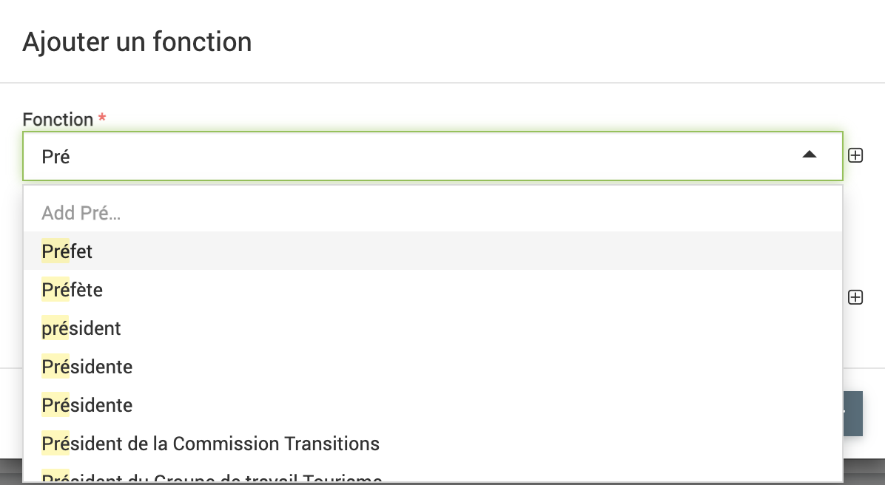
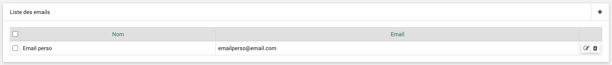
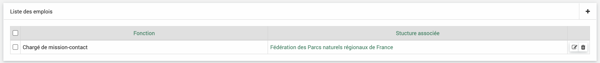
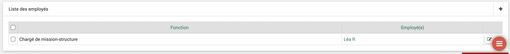
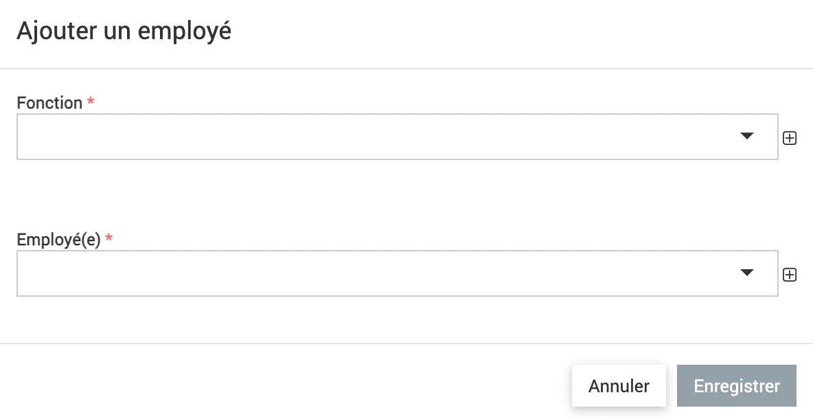
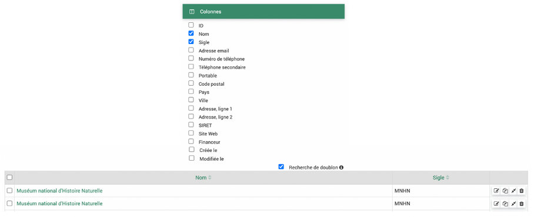
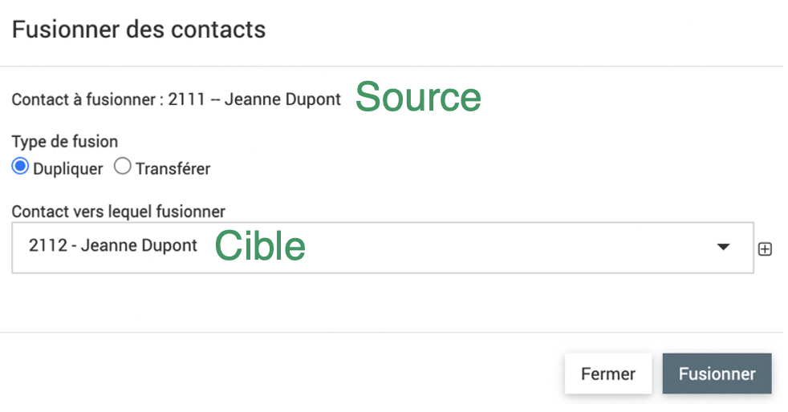

.. include:: ../substitutions.rst
Annuaire
========

|données| > |annuaire|

L'annuaire permet de répertorier les contacts et structures partenaires. Les contacts et structures peuvent être liés par les fonctions (voir plus bas). Les contacts peuvent être supprimés pour respecter la demande de suppression des données personnelles. Les structures peuvent être répertoriées en tant que financeur et être rattachées aux fiches dans l'onglet **acteurs**. Pour éviter des pertes de données, une fois rattachée (à des enveloppes ou fiches), les strutures ne pourront pas être supprimées (cf :ref:`FAQ`).

Particularités des fonctions : Les fonctions peuvent être ajoutées dans l'onglet |annuaire| > |fonctions| ou bien à la volée quand on fait la liaison entre un contact et une structure. On peut chercher la fonction et si elle n'existe pas encore la créer en cliquant sur add.

Contacts
--------

Les fonctionnalités de tableau et d'ajout sont détaillées dans la partie :ref:`Fonctionnalités générales`.

En cliquant sur le nom ou prénom, on accède aux détails du contact.
Seuls **nom** et **prénom** sont les champs obligatoires.

.. image:: images/Formulaire_contact.png
  :width: 700

On peut rattacher des **mots clés** aux contacts, la case "Contact" doit être cochée dans le mot clé.

Si un seul email n'est pas suffisant pour le contact on peut rajouter d'autres emails dans la partie **Liste des emails** en cliquant sur |ajout_plus|. 

Les emplois peuvent être rajoutés dans la **Liste des emplois**. C'est cette partie qui permet de rattacher les contacts aux structures. **Fonction** doit être définie dans la partie **fonctions** de l'annuaire: |annuaire| > |fonctions|. **Structure** doit être définie dans la partie |annuaire| > |structures| au préalable.

.. image:: images/Ajout_fonction_contact.png
  :width: 300

.. warning:: 
	Les champs "Liste des emails" et "Liste des emplois" apparaissent seulement après avoir enregistré une première fois le contact.

Tout en bas s'affiche des champs paramétrables. Ils peuvent être paramétrés dans |administration| > |champs|, dans l'onglet Contact.

Ils peuvent servir à préciser par exemple le département dans lequel le contact travaille dans la structure.

.. warning::
	Lorsqu'il y a des champs paramétrables, un bouton "enregistré" est ajouté. Si des champs paramétrables sont modifiés il faut cliquer sur le bouton enregistrer en bas pour les enregistrer. Si des champs dans la partie contact principale sont ajoutés, il faut cliquer sur le bouton enregistrer un peu plus haut pour les enregistrer.

Structures
----------

Les fonctionnalités de tableau et d'ajout sont détaillées dans la partie :ref:`Fonctionnalités générales`.

En cliquant sur le nom, on accède aux détails de la structure.
Seuls **nom** est le champ obligatoire.

.. image:: images/Formulaire_structure.png
  :width: 700

La case **Financeur** doit être cochée pour pouvoir associer cette structure à des enveloppes.

On peut rattacher des **mots clés** aux structures, la case "Structure" doit être cochée dans le mot clé.

Les employés peuvent être rajoutés dans la **Liste des employés**. C'est cette partie qui permet de rattacher les contacts aux structures. **Fonction** doit être définie dans la partie **fonctions** de l'annuaire : |annuaire| > |fonctions|. **Employé** doit être définie dans la partie |annuaire| > |contacts| au préalable.

.. warning:: 
	Le champs "Liste des employés" apparaît seulement après avoir enregistré une première fois le contact.

Recherche de doublons
---------------------

1. Dans le menu des colonnes, choisissez les colonnes à afficher qui seront celles à comparer pour les doublons
2. Cocher la case recherche de doublons
3. L’affichage s’actualise avec les lignes qui ont un contenu identique dans les colonnes sélectionnées

.. warning ::
  - Les colonnes ID, Créé le, Modifié le ainsi que les mots clés et la fonction qui relie contacts et structures ne font pas partie du périmètre de recherche pour doublons. Ces colonnes même cochées ne seront pas comparées pour établir les doublons.

.. Note ::
  - Il faut décocher et recocher la case après chaque changement du choix des colonnes à comparer pour refaire la recherche de doublons.
  - La fonctionnalité permet de rechercher des doublons avec une correspondance complète mais les majuscules et minuscules sont considérées égales.

  Exemple : "Structure test" et "structure test" sont considérées comme des doublons mais "structure test 1" ne sera pas un doublon de "structure test"

Fusion
------

1. Cliquer sur l’icône « Fusionner » en fin de ligne de l’élément que vous souhaitez fusionner (la source)

.. image:: images/Fusionner.png
  :width: 300

2. Une boîte de dialogue s’ouvre dans laquelle vous pouvez sélectionner le type de fusion. « Dupliquer » copie le rattachement contact-structure de la source vers la cible sans supprimer la source alors que « Transférer » supprime la source.

3. Indiquer le contact vers lequel fusionner qui sera la cible : soit en remplissant les premières lettres et par autocomplétions soit en recherchant via le plus.

4. Cliquer sur fusionner

L’ID (ici 2111 et 2112) permet de faire la différence entre des contacts qui ont les mêmes noms et prénoms.

Liaison PostParc
----------------

Une liaison automatique entre l’annuaire et le logiciel PostParc (https://www.postparc.fr/) est disponible.

Pour l’utiliser, il faut : 

- avoir un compte postparc
- demander un compte API aupres de l'équipe de POSTPARC (PROBESYS)
- demander le raccordement par l’assistance qui doit se faire en base de données.

La synchronisation automatique s’effectue tous les dimanches matins.

Dans |administration| -> |configuration|, onglet Commandes vous pouvez lancer la synchronisation manuellement.

.. image:: images/synchro_postparc.png
  :width: 600

Caractéristiques de la liaison :

- Toutes les données des structures et contacts remontent automatiquement de PostParc à EVA (et seulement dans ce sens) ainsi que les rattachements contact-structures. 
- La case financeur est cochée « non » par défaut, la fonction de rattachement contact-structure si elle n’a pas été définie dans PostParc sera « membre » par défaut. 
- Une colonne « IMPORT POSTPARC » indique si le contact ou la structure a été importée de PostParc « SYNC-POSTPARC », supprimé dans PostParc « SUPP-POSTPARC », s’il a été créé dans EVA cette colonne sera vide. Ainsi si un contact a été supprimé dans PostParc, il ne sera pas supprimé automatiquement dans EVA pour éviter des pertes de données.
- L’appartenance des structures à des groupes et types d’organisme définis dans PostParc remontent dans les mots clés, ces mots clés ne sont pas administrables dans EVA, ils n’apparaissent pas dans les mots clés de l’administration EVA mais ils peuvent être utilisés en filtres comme les autres mots clés.
- L’appartenance des contacts à des groupes fonctionne comme pour les structures.
