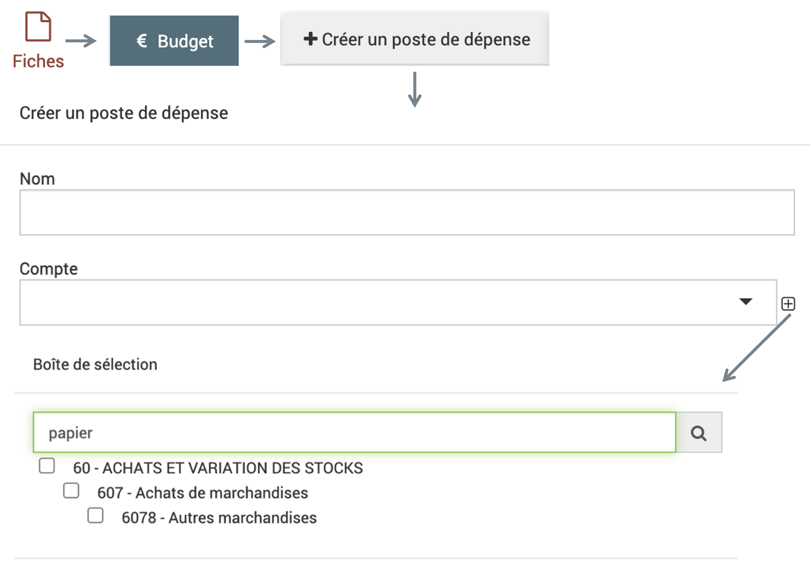

.. include:: ../substitutions.rst
Budget
======

|données| > |budget|

Ambition du module Budget : Suivre tout le budget du parc, du dialogue de gestion à la clôture. 

Le **dialogue de gestion** pourra avoir lieu dans les fiches, chaque chargé de mission sera amené à prévoir le budget nécessaire à son action. Les échanges jusque validation du budget sont rythmés par les **statuts des fiches** et les **statuts financiers**. Les statuts et dates de caducité peuvent être couplés aux **alertes** (envoi mail automatique), ce qui permet un **suivi de la réalisation financière** des projets. Les **données comptables** peuvent être remontées automatiquement depuis le logiciel de comptabilité (si compatible) ou par export/import à une périodicité choisie.

Pour mettre en place le module budget, il faut avoir les fiches rattachées à des **codes** (analytiques, code unique pour chaque fiche), ensuite créer les différents **comptes** (dépenses et recette) puis les **financeurs** (dans le module |annuaire| > |structures|) et les rattacher à leurs **enveloppes**. 

.. image:: images/Budget_eva.png
  :width: 500

Enveloppes
----------

Les enveloppes permettent de définir des financements fléchés par les financeurs.

Pour créer une enveloppe, il faut cliquer sur le |bouton_3_traits| en bas à droite ou faire un import comme indiqué dans dans la partie :ref:`Fonctionnalités générales`.

Le formulaire demande les informations suivantes :

* **Code** : code de l'enveloppe si c'est utile pour votre comptabilité

* **Nom** (obligatoire) : le nom de l'enveloppe

* **Financeur** (obligatoire) : associer le financeur grâce aux champs déroulants, les financeurs se trouvent dans le module |annuaire| > |structures| avec la case financeur cochée

* **Début** : début de validité de l'enveloppe

* **Fin** : fin de validité de l'enveloppe

* **Montant** : montant de l'enveloppe

.. note::
	Les dates de l'enveloppe ne sont pas contraignantes, on peut rattacher des montants en dehors de ces dates.

Un tableau s'affiche sur le côté avec les postes de dépense et de recette qui sont rattachés à l'enveloppe.

.. note :: 
	- Dans une même fiche, une enveloppe ne peut être rattachée qu'une seule fois à un poste de recette. Si la même enveloppe est rattachée à un autre poste de recette cela ne sera pas pris en compte dans le bilan de l'enveloppe (tableau poste de recette)
  	- Pour les dépenses rattachées aux fiches, si on indique un poste de dépense après avoir indiqué un poste de recette rattaché à une enveloppe, le montant du poste de dépense sera proportionnel au montant que représente le poste de recette de cette fiche par rapport au montant total de l'enveloppe. *Par exemple si on a une enveloppe à 100 euros en tout, si on a un poste de recette dans la fiche à 50 euros (=moitié), la moitié du total des postes de dépense de cette fiche apparaîtra dans cette enveloppe.*

.. warning ::
	- Les montants sont arrondis à la virgule donc parfois comme on a un petit % ça donne zéro.
	- Si le montant total de l'enveloppe est à zéro (non rempli), le montant total des postes de dépense des fiches associées à l'enveloppe dans les postes de recette sera attribué
	- Dans une fiche si on indique un montant de poste de recette plus élevé que le montant de l'enveloppe à laquelle elle est rattachée un message rouge non bloquant apparaîtra sous le montant.

Comptes
-------

Les comptes sont séparés entre comptes de dépense (haut du tableau) et comptes de recette (bas du tableau). Ils permettent de refléter les différents comptes de la comptabilité.

Pour créer un compte, il faut cliquer sur le |bouton_3_traits| en bas à droite ou faire un import comme indiqué dans dans la partie :ref:`Fonctionnalités générales`.

Le formulaire demande les informations suivantes :

* **Code** (obligatoire) : code du compte selon votre comptabilité

* **Nom** (obligatoire) : le nom du compte

* **case par dédaut** : ?

* **Description** : Indiquer la description du compte ici

* **Parent** : On peut indiquer le compte parent ici, sachant que l'on peut avoir des comptes enfants, petits-enfants...

* **Type de mouvement** (obligatoire) : dépense ou recette (ce champ se remplit automatiquement si on indique un parent, car le type de mouvement doit être le même que le parent)

La **Description** peut être utile à renseigner car par la suite lorsque l’on cherche un compte depuis la partie budget d’une fiche par exemple, le moteur de recherche pourra retrouver le compte grâce à la description. Cela permet d’avoir des titres de comptes assez succincts mais de garder un certain nombre d’information accessible dans les descriptions.

Exemple : 
Compte 6078 avec description papier, si l'on cherche le mot papier dans la boîte de sélection des comptes, on pourra retrouver ce compte 6078.

.. image:: images/Creer_compte_ex.png
  :width: 500

.. note ::
	Dans les fiches, les données rattachées a un compte enfant d'un autre compte ne remonte pas dans le compte parent

Statuts financiers
------------------

Les statuts financiers sont définis ici et peuvent être associés aux fiches. Ils permettent de qualifier les fiches en fonction de leur statut financier (pour faire des filtres, alertes...). 

Lors de la création d'un statut financier, on peut choisir de cocher la case **Verouille le module budget**, lorsqu'une fiche est associée à un statut qui verouille, l'onglet budget de la fiche n'est plus modifiable. Ceci est visible grâce au symbole de cadenas à côté. L'onglet reste accessible et visible mais il ne peut plus être modifié.

.. image:: images/Verouille_budget.png
  :width: 150

Les statuts financiers peuvent être utilisés lors d'import financier également : en choisissant un statut au moment de l'import, les fiches qui sont modifiées par l’import seront ensuite passées au statut choisi.

Imports budget
--------------

Les imports budget sont traités dans la partie :ref:`Fonctionnalités générales`.
