.. include:: ../substitutions.rst
Fiches
======

|suivi_projet| > |fiches|

Module fiche - intro
--------------------

Les fiches représentent le module central dans EVA. La liaison avec d'autres données suppose d'avoir rempli les autres modules associés en amont.

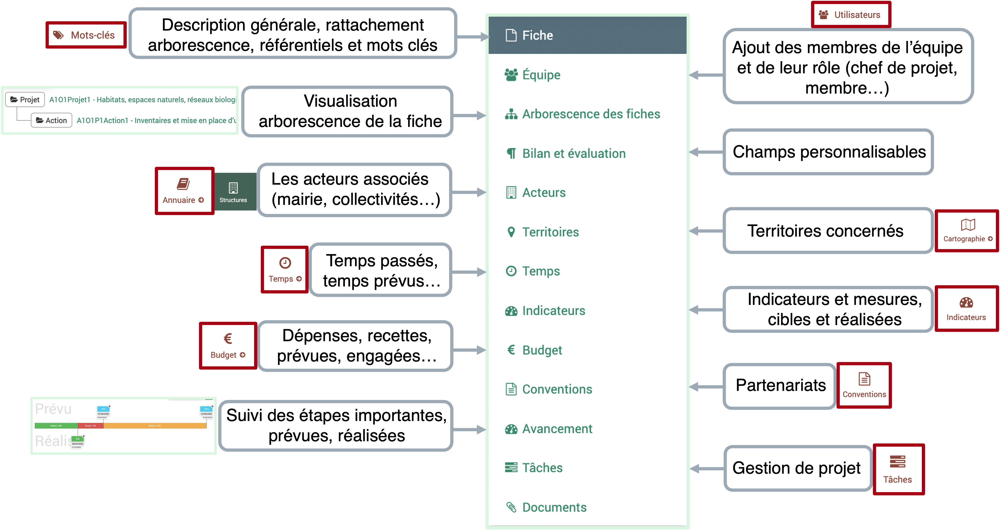

Particularités du tableau des fiches
------------------------------------

*(Les généralités sur le tableau des fiches sont détaillées dans la partie* :ref:`Fonctionnalités générales` *)*

Filtre fiche par défaut
~~~~~~~~~~~~~~~~~~~~~~~

Il y a un filtre par défaut lorsque l'on arrive sur les fiches : le tableau ne montre pas les fiches archivées par défaut. Cela permet d'avoir une vue des projets en cours seulement, lorsqu'un projet est terminé, le passage en statut "archivé" permet de garder les informations sans surcharger la vue tableau.

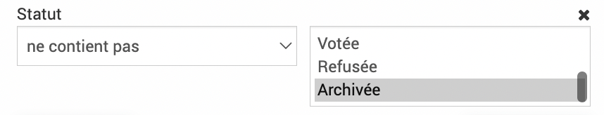

Case cochée
~~~~~~~~~~~

En cochant une case devant une ligne de fiche, on peut faire apparaître, deux fonctionnalités : |gomme_tableau| et |crayon_modif_ligne|.

La |gomme_tableau| permet comme dans les autres tableaux de masquer à la vue et à l'export une ligne du tableau. Le |crayon_modif_ligne| permet de modifier le statut de plusieurs fiches en même temps via une boîte de dialogue. Pour que le statut soit bien changer il faut cocher la case "Utiliser".

.. Warning::
	Le message de validation indique une erreur même s'il n'y en a pas.

Vue arborescente
~~~~~~~~~~~~~~~~

Via le tableau des fiches on peut accéder à la vue arborescente |arbo_fiches|. (Retour vue liste via |vue_liste|)

La vue arborescente permet de visualiser les fiches selon leur organisation en référentiel, mot clé ou arborescence initiale.
**L'arborescence initiale** fait référence au niveau des fiches (fiches parent ou enfant d'une autre fiche) sans relation aux référentiels.

Vous pouvez sélectionner le type d'arborescence (arborescence initiale, référentiel ou mot clé) via :

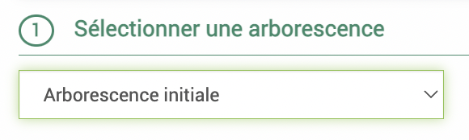

Vous pouvez ensuite sélectionner les niveaux concernés, ce sont les niveaux de l'arborescence choisie. Donc si vous avez sélectionné l'arborescence initiale, ils font référence aux relations parents/enfants entre les fiches. Si vous avez sélectionné une arborescence référentiel ou mot clé, le niveau fait référence à l'arborescence du référentiel ou mot clé. Par exemple : si vous avez choisi un référentiel de charte avec des niveaux d'arborescences type Axes>
Orientations>Mesures, si vous choissisez les niveaux à partir du niveau 0 jusqu'au niveau 1, seules les fiches rattachées aux Axes et Orientations seront affichées.

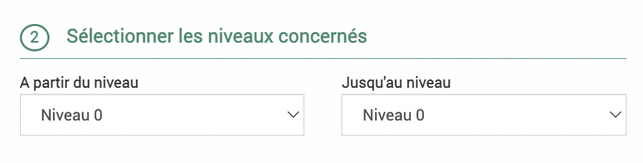

Vous pouvez ensuite appliquer des filtres par niveau.

Pour l'arborescence initiale :
Vous pouvez en amont choisir un niveau de référence qui vous permet ensuite de choiir d'afficher ou non les niveaux auxquels aucune autre fiche n'est rattachée.

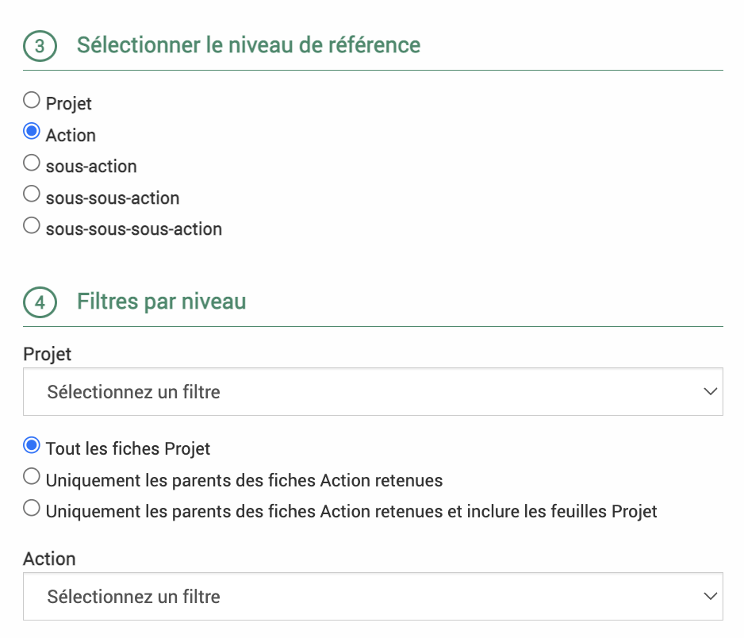

Pour les arborescences référentiel et mot clé :
Vous pouvez choisir pour chaque niveau si vous souhaitez retirer les parties du référentiel auxquelles il n'y a pas de fiches rattachées.

.. image:: images/Filtres_niveaux.png
  :width: 500

Dans l'arborescence, la case « Décochez cette case pour désactiver la recherche arborescente » n'existe pas. Pour sélectionner une seule partie du référentiel sans les fiches rattachées à des niveaux inférieurs, il faudra sélectionner cette partie du référentiel à tous les niveaux.

Par exemple ci-dessous, on affiche uniquement les fiches reliées à l'orientation 1.1 et pas celles qui pourraient être reliées aux mesures de cette orientation par exemple.

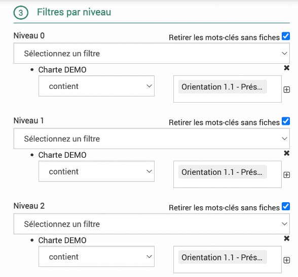

.. image:: images/arbo2.png
   :width: 300

Le critère de tri par code analytique ou titre réordonne l'ordre dans lequel les fiches apparaissent à l'écran. Elle apparaissent par ordre alphabétique des codes analytiques si "code analytique" est choisi (les fiches sans codes apparaissent avant), et par ordre alphabétique des titres de fiches si "titre" est choisi.

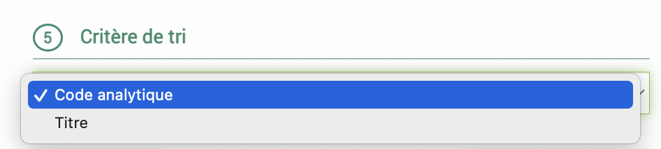

**Il faut cliquer sur le bouton** |recherche| **pour afficher l'arborescence et recliquer si on change des paramètres.**

L'arborescence choisie s'affiche sur la gauche.

..warning::
  J'ai un filtre sur un niveau qui ne devrait pas faire apparaître une partie de mon référentiel mais cette partie apparaît quand même ?
  Cela peut être dû à une fiche rattachée à une partie du référentiel sélectionné qui est aussi rattachée à cette partie du référentiel qui ne devrait pas apparaître.

En cliquant sur le logo |dossier| on peut déplier ou replier des parties de l'arborescence. Pour tout replier ou déplier d'un coup, vous pouvez utiliser les boutons dans la partie de sélection de l'arborescence.

.. image:: images/Tout_replier.png
  :width: 150

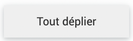

Comme dans les autres tableaux on peut choisir les colonnes affichées et enregistrer des requêtes.

.. image:: images/Arbo_col_req.png
  :width: 300

En bas à droite, on peut exporter sous format Word ou Excel, ce sont des exports qui ont dû être paramétrés au préalable (dans |administration| > |exports|). Pour les exports word des arborescences autres que l'arborescence initiale, il faut l'avoir indiqué dans le paramétrage de l'export. 

.. image:: images/Export_arbo.png
  :width: 500

Remplir une fiche
-----------------

.. Note::
	Lors de la création d'une fiche via le bouton d'ajout |bouton_3_traits|, on accède à la première partie du formulaire avec les champs principaux de la fiche. Il faut l'enregistrer une première fois pour accéder au reste des champs. Lors de la création d'une fiche, seul le titre est obligatoire.

En fonction du modèle de fiche choisi, on peut avoir accès à différents champs. Le modèle de fiche peut être modifié en haut à gauche :

.. Warning::
	Ne pas oublier d'enregistrer après chaque modification !

Onglet fiche
~~~~~~~~~~~~

Les champs accessibles :

* **Titre** : champ obligatoire

* **Code** (analytique ou non) : doit être unique, permet de rattacher la fiche à d'autres informations par la suite (feuille de temps, budget)

* **Rattachement** (à l'arborescence initiale) : rattache à la fiche comme enfant d'une fiche qui devient son parent, c'est ce qui décide le niveau de la fiche. Deux façons de chercher la fiche à laquelle la rattacher : 1. Commencer à taper le nom de la fiche dans le champs, des propositions appraîtront en dessous. 2. Cliquer sur le |petit_plus|, la liste des fiches apparaît, en commençant à taper le nom dans la barre de recherche, les fiches sont filtrées, cocher la fiche à laquelle rattacher cette fiche.

* **Temps prévu** : contribue à la synthèse des temps dans l'onglet temps

* **Dates importantes** : Dates de démarrage et de fin, prévue et effective, date de programmation. Cliquer sur calendrier pour choisir la date ou bien rentrer la date au format JJ/MM/AAAA.

* **Maîtrise d'ouvrage externe** : cocher la case permet l'affichage d'un champs pour indiquer le maître d'ouvrage (à sélectionner parmi les structures de l'annuaire), il changera également le sous-onglet "dépenses" dans l'onglet budget en "dépenses de subventions du parc"

* **Statut financier** : à choisir parmi la liste définie dans le module |budget| > |statuts_financiers|

* **Plusieurs cadres de champs libres** : objectifs, description, contexte, bilans...

* Ensuite s'affiche des **champs personnalisables**

* **Mots clés et référentiels** : à rattacher

Onglet équipe
~~~~~~~~~~~~~

Les différents membres sont à renseigner au préalable dans |administration| > |profils| > |utilisateurs|

Ajouter les **chefs de projet** et **validateurs** grâce au |petit_plus| à côté des champs.
Les chefs de projets recoivent un mail lorsque la fiche est passée en statut "Validée", les validateurs recoivent un mail lorsque la fiche est passée en statut "À valider". Le tableau des membres de l'équipe se remplit automatiquement avec les chefs de projet (indiqué via |écrou|) et validateurs (indiqué via |tick|).

Ajouter les membres de l'équipe grâce au bouton d'ajout des membres. Une boîte de dialogue s'ouvre pour choisir l'utilisateur.

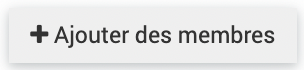

* Soit commencez à rentrer le nom du membre, les utilisateurs s'affichent par auto-complétion, choissisez celui qui vous convient.

* Soit cliquez sur le |petit_plus| et cochez le nom qui vous convient.

N'oubliez pas de cliquer sur ajouter dans cette boîte de dialogue avant de quitter et ensuite d'enregistrer la fiche.

.. note :: 
	Le rôle ici est "membre" par défaut sauf si vous avez défini un mot clé associé aux membres (dans ce cas il se mettra dans la colonne rôle par défaut).

Onglet arborescence
~~~~~~~~~~~~~~~~~~~

Dans cet onglet, on a accès à l'arborescence de la fiche en question : ses parents et enfants. On peut passer de la vue arborescente à la vue liste en cliquant sur les boutons associés.

.. image:: images/Vue_arbo_liste.png
  :width: 300

En "vue liste", on ne voit pas la fiche courante seulement celles qui lui sont rattachées. En "vue arborescente", en cliquant sur le logo |dossier| on peut déplier ou replier des parties de l'arborescence.

Onglet personnalisable
~~~~~~~~~~~~~~~~~~~~~~

L'onglet personnalisable peut avoir un nom différent pour chaque compte de parc (modifié en base de données par le prestataire). Il peut être paramétrable dans le module |administration| > |champs|

Onglet acteurs
~~~~~~~~~~~~~~

Cet onglet permet de rattacher des structures à la fiche. Ces structures peuvent être renseignées dans le module |données| > |annuaire| > |structures|.

Cliquez sur |ajout_acteur| pour ajouter une structure. Une boîte de dialogue s'ouvre pour choisir la structure.

* Soit commencez à rentrer le nom de la structure, les structures s'affichent par auto-complétion, choissisez celle qui vous convient.

* Soit cliquez sur le |petit_plus| et cochez le nom qui vous convient.

N'oubliez pas d'enregistrer cette boîte de dialogue avant de quitter.

.. note :: 
	Les mots clés associés aux acteurs (et non aux structures) peuvent être ajoutés via cette boîte de dialogue.

Onglet territoires
~~~~~~~~~~~~~~~~~~

Cet onglet permet de rattacher des territoires à la fiche. Ces territoires peuvent être renseignés dans le module |données| > |Territoires|.

* Soit commencez à rentrer le nom du territoire, les territoires s'affichent par auto-complétion, choissisez celui qui vous convient.

* Soit cliquez sur le |petit_plus|, rentrer les premières lettres et cliquer sur la |loupe|, puis choissisez le(s) territoire(s).

* Soit cliquez sur le |petit_plus|, puis les traits pour afficher l'ensemble des territoires (attention cela peut prendre du temps).

N'oubliez pas de cliquer sur sélectionner dans cette boîte de dialogue avant de quitter et ensuite d'enregistrer la fiche.

La carte affiche les différents territoires associés à la fiche.

Pour **supprimer** un territoire, cliquez dans la barre des territoires pour positionner votre curseur et appuyer sur supprimer sur votre clavier.

Onglet temps
~~~~~~~~~~~~

L'onglet temps est divisé en quatre sous-onglets : 

* Synthèse
* Temps passé
* Temps prévu
* Temps d'absence

Sous-onglet synthèse
####################

Pour les fiches parents la synthèse faire remonter les données des fiches enfants, pour ne pas que ça soit le cas il faut décocher la case :

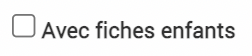

Le tableau de synthèse reprend les données suivantes :

* **Budget temps prévu général** : défini dans l'onglet Fiche de la fiche dans le champs "Temps prévu", il additionne les temps prévus des fiches enfants si la case est cochée

* **Total temps passé des agents** : défini dans le sous-onglet temps passé de l'onglet temps, il additionne les temps passés des fiches enfants si la case est cochée

* **Solde budget temps fiche** : fait la différence entre les deux lignes précédentes

* **Total temps prévus affectés** : défini dans le sous-onglet temps prévu de l'onglet temps, il additionne les temps prévus des fiches enfants si la case est cochée

* **Solde budget non affecté** : fait la différence entre le budget temps prévu général et le total temps prévus affectés

* **Total temps passé / total temps prévu affecté** : montre le ratio entre le temps passé défini dans le sous-onglet "Temps passé" et le temps prévu défini dans le sous-onglet "Temps prévu".

La **répartition par utilisateur** reprend les temps passés, temps prévus et le ratio des deux par utilisateur. Il prend en compte les fiches enfants si la case est cochée.

La **répartition par fiche** reprend le budget temps prévu général, le total temps passé et le total temps prévus affectés par fiches enfants, s'il y en a.

.. warning::
  Attention il est possible de rattacher des temps d'une personne qui n'est pas inclue dans le sous-onglet "équipe" ce qui peut porter à confusion, si vous avez des filtres sur les membres de l'équipe. 
  Ex : Monsieur Martin enregistre du temps sur le projet A1 mais n'est pas enregistré comme membre de l'équipe -> le filtre sur "fiche qui a comme membre de l'équipe Monsieur Martin" ne ressortira pas la fiche où Monsieur Martin a enregistré du temps s'il n'a pas aussi été associé comme membre de l'équipe.

Sous-onglet temps passé
#######################

Les temps passés peuvent être ajoutés dans la fiche via le bouton d'ajout d'une feuille de temps.

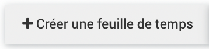

Dans la boîte de dialogue qui s'ouvre la fiche actuelle et l'utilisateur connecté sont remplis par défaut. Les champs de date de début et de fin sont obligatoires et peuvent être rempli en cliquant sur |vue_calendrier| pour faire apparaître un calendrier. En cliquant sur |calculatrice|, le nombre d'heures se calcule automatiquement entre le temps de début et de fin.

On peut ajouter un titre, une description, des mots clés et des territoires aux temps passés.

On peut afficher les temps passés en vue liste |vue_liste| ou calendrier |vue_calendrier|.

.. Note::
	Les temps passés peuvent aussi être ajoutés via le module |temps| (feuille de temps, ajout hebdomadaire ou sychronisation)

Sous-onglet temps prévu
#######################

Les temps prévus peuvent être ajoutés dans la fiche via le bouton d'ajout d'une feuille de temps.

Dans la boîte de dialogue qui s'ouvre la fiche actuelle et l'utilisateur connecté sont remplis par défaut. Les champs de date de début et de fin sont obligatoires et peuvent être rempli en cliquant sur |vue_calendrier| pour faire apparaître un calendrier. En cliquant sur |calculatrice|, le nombre d'heures se calcule automatiquement entre le temps de début et de fin.

On peut ajouter un titre, une description, des mots clés et des territoires aux temps prévus.

On peut afficher les temps prévus en vue liste |vue_liste| ou calendrier |vue_calendrier|.

Sous-onglet temps d'absence
###########################

Les temps d'absences peuvent être ajoutés dans la fiche via le bouton d'ajout d'une feuille de temps.

Dans la boîte de dialogue qui s'ouvre la fiche actuelle et l'utilisateur connecté sont remplis par défaut. Les champs de date de début et de fin sont obligatoires et peuvent être rempli en cliquant sur |vue_calendrier| pour faire apparaître un calendrier. En cliquant sur |calculatrice|, le nombre d'heures se calcule automatiquement entre le temps de début et de fin.

On peut ajouter un titre, une description, des mots clés et des territoires aux temps d'absence.

On peut afficher les temps d'absence en vue liste |vue_liste| ou calendrier |vue_calendrier|.

.. warning::
	On ne peut pas indiquer les types d'absence dans le formulaire d'ajout des fiches (mais c'est un champ obligatoire dans le formulaire du module temps)

Onglet indicateurs
~~~~~~~~~~~~~~~~~~

Cet onglet permet d'ajouter des mesures à des indicateurs. Les indicateurs peuvent être renseignés dans le module |données| > |indicateurs|.

Une boîte de dialogue s'ouvre en cliquant sur :

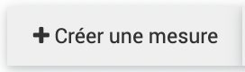

L'indicateur est à choisir :
* Soit commencez à rentrer le nom de l'indicateur, les indicateurs s'affichent par auto-complétion, choissisez celui qui vous convient.

* Soit cliquez sur le |petit_plus| et cochez l'indicateur qui vous convient.

Il faut choisir ensuite la période, le type et la date de fin à minima.

.. warning::
	Le module indicateur a vocation a être revu, la documentation à ce sujet sera plus fourni après la refonte.

Onglet budget
~~~~~~~~~~~~~

L'onglet budget est divisé en trois sous-onglets : 

* Dépenses (ou dépenses de subvention)
* Recettes
* Codes financiers

Sous-onglet Dépenses
####################

.. Note::
	Si la case maîtrise d'ouvrage externe a été cochée dans l'onglet "Fiche" de la fiche, l'onglet dépenses indiquera "Dépenses de subvention du parc".

Une boîte de dialogue s'ouvre en cliquant sur :

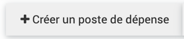

Ce poste de dépense peut être rattaché à un compte (de dépense) qui est à définir dans le module |données| > |budget| > |comptes|.

Le rattachement à un parent propose des postes de dépenses (avec le code du compte rattaché) qui viennent de la fiche parent. Toutes les dépenses remontent à la fiche parent. 

.. warning :: 
  Quand on rattache à un poste parent, le "montant" global du poste enfant ne remonte pas dans le poste parent, seulement les lignes.

Une fois le poste de dépense créé, on peut ajouter les lignes en cliquant sur le |ajout_plus| en fin de ligne. Cela permet d'ajouter une ligne par dépense dans le même poste de dépense. On peut choisir le type de dépense mais aussi plus de détails (Tiers, exercice, Bordereau du mandatement, Mandat, Engagement, Compléments, Date Facture) accessible dans l'onglet "détails" de la boîte de dialogue.

*Par exemple* : une ligne pour la dépense prévue, deux lignes pour la dépense engagée car engagée en deux fois et deux lignes pour la dépense payée car payée en deux fois aussi.

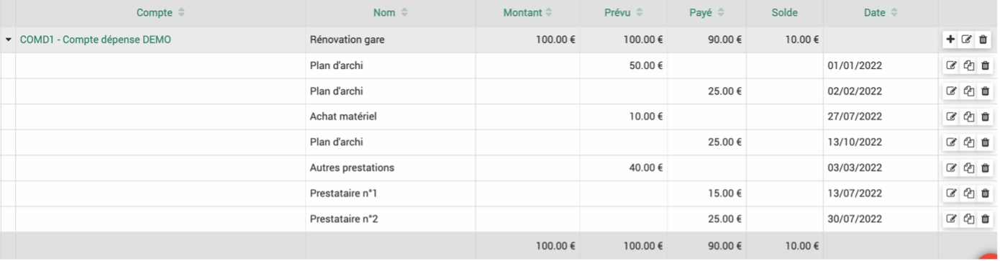

Les lignes qui remontent des fiches enfants sont affichées bleutées.

L'affichage des dépenses peut être regroupé selon différents critères :

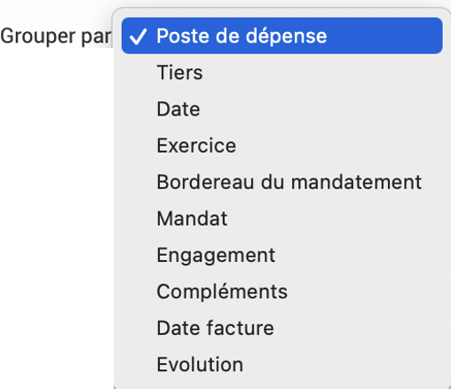

Un graphique peut être affiché pour avoir un aperçu des dépenses, en cliquant sur |graphique|. En cliquant sur les cercles des différentes données colorées, on peut choisir quelle donnée afficher.

Sous-onglet Recettes
####################

Une boîte de dialogue s'ouvre en cliquant sur :

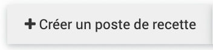

Ce poste de recette peut être rattaché à un compte (de recette) qui est à définir dans le module |données| > |budget| > |comptes|.

Le rattachement à un parent propose des postes de recette (avec le code du compte rattaché) qui viennent de la fiche parent. Toutes les recettes remontent à la fiche parent. 

Il peut aussi être rattaché à une enveloppe qui est à définir dans le module |données| > |budget| > |enveloppes|. 

On peut choisir plus de détails dans l'onglet "détails" de la boîte de dialogue de création d'un compte (les dates de caducité, d'envoi du dossier, informations sur l'arrêté, délibération, montant subventionable).

.. warning :: 
  Dans une même fiche, une enveloppe ne peut être rattachée qu'une seule fois à un poste de recette. Si la même enveloppe est rattachée à un autre poste de recette cela ne sera pas pris en compte dans le bilan de l'enveloppe.

Une fois le poste de recette créé, on peut ajouter les lignes en cliquant sur le |ajout_plus| en fin de ligne. Cela permet d'ajouter une ligne par recette dans le même poste de recette. On peut choisir le type de recette mais aussi plus de détails Tiers, exercice, mandat...) accessible dans l'onglet "détails" de la boîte de dialogue.

Les lignes qui remontent des fiches enfants sont affichées bleutées.

L'affichage des recettes peut être regroupé selon différents critères :

.. image:: images/Grouper_poste_recette.png
  :width: 300

Un graphique peut être affiché pour avoir un aperçu des recettes, en cliquant sur |graphique|. En cliquant sur les cercles des différentes données colorées, on peut choisir quelle donnée afficher.

Sous-onglet Codes financiers
############################

Si une fiche dure plusieurs années mais on a besoin d’un code par année pour les dépenses ou recettes, on peut créer des codes financiers par année dans les fiches dans ce sous-onglet.

Les codes financiers peuvent être créer en cliquant sur :

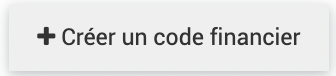

Ils apparaissent ensuite sur dans l'onglet "Fiche" de la fiche et peuvent être utilisés pour les imports budget par exemple.

.. warning::
  Dans le module budget de la fiche, peut apparaît un champ "saisie simplifié", dans le module administration peut apparaître un sous module budget.
  Ces éléments sont à ignorer car ce sont des reliquats d'ancienne fonctionnalité qui ne sont plus accessibles et seront complètement supprimés prochainement. Pour ne pas les voir dans vos EVA vous pouvez dans Admin -> rôle enlever les droits de les voir pour tous le monde.
  Dans chaque rôle sur les lignes "Poste de dépense : saisie simplifiée" et "Poste de dépense référentiel" -> décocher la case "voir"

Onglet conventions
~~~~~~~~~~~~~~~~~~

Dans cet onglet on peut voir les conventions rattachées à la fiche. On ne peut pas ajouter de convention via la fiche. Les conventions sont paramétrées et rattachées aux fiches dans le module |données| > |conventions|.

Onglet avancement
~~~~~~~~~~~~~~~~~

Les avancements permettent de poser les jalons du projet. Ils ne sont pas reliés aux tâches ni aux temps prévus/passés.

.. Warning::
	L'onglet avancement a vocation a être revu, la documentation à ce sujet sera plus fourni après la refonte.

Onglet tâches
~~~~~~~~~~~~~

Les tâches permettent d'attribuer des tâches à des utilisateurs. L'ensemble des tâches est visible dans le module |suivi_projet| > |tâches|. Les tâches ne sont pas reliées aux avancements ou aux temps prévus/passés.

.. Warning::
	Le module tâche a vocation a être revu, la documentation à ce sujet sera plus fourni après la refonte.

Onglet documents
~~~~~~~~~~~~~~~~

Cet onglet permet d'associer des documents ou des liens à la fiche.

En cliquant sur le bouton d'upload, une boîte de dialogue s'ouvre :

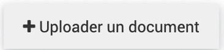

On peut choisir d'associer un document ou un lien dans cette boîte de dialogue. Il est préférable d'ajouter un lien car EVA n'est pas fait pour être une base de document.

Actions sur la fiche
--------------------

Raccourci arborescence
~~~~~~~~~~~~~~~~~~~~~~

Pour voir rapidement si la fiche a des fiches parents, on peut cliquer sur le logo |arbo_fiches| à côté du titre de la fiche en haut. Cela affiche seulement les parents et non les enfants.

Statuts des fiches
~~~~~~~~~~~~~~~~~~

En haut de la fiche on peut changer le statut de la fiche. Les accès aux fiches de différents statuts peuvent être différents en fonction des droits.

.. Note::
	Le nom des statuts peut être modifié par le prestataire sur demande, les statuts décrits ici n'ont donc pas forcément le même nom dans votre EVA.

* |statut_brouillon| : tout est modifiable
* |statut_ensuspens| : tout est modifiable
* |statut_avalider| : l'onglet "Fiche" et les chefs de projets et validateurs dans "équipes" ne sont plus modifiables, le changement en "à valider" envoie un mail aux validateurs de la fiche.
* |statut_validée| : l'onglet "Fiche" et les chefs de projets et validateurs dans "équipes" ne sont plus modifiables, le changement en "validée" envoie un mail aux chefs de projet de la fiche.
* |statut_votée| : l'onglet "Fiche" et les chefs de projets et validateurs dans "équipes" ne sont plus modifiables
* |statut_refusée| : tout est modifiable
* |statut_archivée| : tout est modifiable

La date de modification du statut des fiches est consultable en cliquant en haut à droite sur :

.. image:: images/Modif_fiches.png
  :width: 100

Ajout d'une note
~~~~~~~~~~~~~~~~

Une note peut être ajoutée à la fiche en cliquant en haut à droite sur :

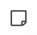

Cela permet de faire passer des messages aux autres membres de la fiche par exemple lorsque l'on change de statut, on peut y ajouter un fichier. Une fois la note ajoutée, le nombre de note apparaît sur le logo note :

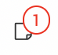

Les notes que l'on a créé peuvent être supprimées en cliquant sur le logo des notes et le logo poubelle en rouge.

.. image:: images/Suppression_note.png
  :width: 300

Toutes les notes peuvent être retrouvée dans le module |suivi_projet| > |notes|, elles sont datées et indiquent l'utilisateur qui a créé la note.

Exports d'une fiche
~~~~~~~~~~~~~~~~~~~

Les logos Word et Excel en haut à droite permettent d'exporter la fiche. Ce sont des exports qui ont dû être paramétrés au préalable (dans |administration| > |exports|).

