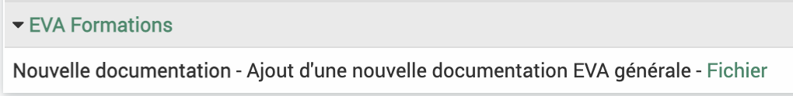

.. include:: ../substitutions.rst
Notes
=====

Le module Note rassemble les notes insérées dans les fiches. Elles permettent de faire passer des messages aux autres membres de la fiche, par exemple lorsque l'on change de statut.

L'affichage des notes n'est pas en tableau.

.. image:: images/Module_notes.png
  :width: 700

Le nom de la fiche à laquelle la note est rattachée est indiquée en vert, en cliquant dessus on rejoint la fiche.

En cliquant sur la flèche sur le côté, on peut dérouler les notes associées à la fiche. Le titre est indiqué avant le tiret et le contenu après le tiret. Si un fichier a été ajouté, on le trouvera en vert et on peut y accéder en cliquant dessus.

En bout de ligne, on peut voir quel utilisateur a édité la note et à quelle date.

.. note::
	On ne peut pas ajouter une note depuis le module note et on ne peut pas modifier une note qui a été ajoutée, la note peut être supprimée depuis le module fiche.

Les notes peuvent être affichées dans l'accueil (seulement les notes des fiches dont on est membre).

.. image:: images/Notes_accueil.png
  :width: 300
