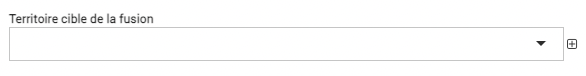

.. include:: ../substitutions.rst
Territoires
===========

|données| > |territoires|

Le module Territoires permet de renseigner les territoires dans EVA, ils pourront ensuite être renseignés dans les différents modules.

Les fonctionnalités de tableau et d'ajout sont détaillées dans la partie `Tableaux <https://documentation-eva.readthedocs.io/fr/latest/Fonctionnalit%C3%A9s-g%C3%A9n%C3%A9rales/Tableaux.html#>`_ et `Ajouts <https://documentation-eva.readthedocs.io/fr/latest/Fonctionnalit%C3%A9s-g%C3%A9n%C3%A9rales/Ajouts.html>`_ des fonctionnalités générales.

Quelques spécifités du tableau des territoires :

- Le tableau des territoires peut être vu en vue arborescente en cliquant en haut à droite sur |arbo_fiches|. Il faut déplier les territoires en cliquant sur |dossier| pour voir les territoires enfants.

- En cochant une case d'un territoire, les options de retirer de la liste |gomme_tableau|  et fusionner |fusion| apparaissent. 

Fusion des territoires
----------------------

En cochant une case, on peut avoir accès à la fonction de fusionner. Cette action ouvre une boîte de dialogue dans laquelle on peut choisir le territoire cible de la fusion.

La fusion ici va supprimer le ou les territoire(s) coché(s), pour ne conserver que le territoire cible. Les informations précédemment rattachées au(x) territoire(s) coché(s) seront rattachées au territoire cible (fiche, temps...).

Ajout des territoires
---------------------

Avec la pastille rouge en bas à droite |bouton_3_traits|, on peut créér ou importer un territoire :

**Créer**

Créer permet de créer un territoire en indiquant : 

- un nom
- un code (code insee par exemple) 
- les contours du territoire en utilisant un fichier (.geojson, .json, .kml, .gpx), ici le fichier n'est pas obligatoire mais s'il n'y a pas de fichier les données rattachées à ce territoire ne seront pas géolocalisées non plus mais seront attachées au nom du territoire
- des territoires enfants

.. warning ::
	Le rattachement entre territoires enfants et parents n'est pas opéré de façon géographique, les fichiers géolocalisés des enfants ne sont pas combinés pour donner des parents. Cette option permet de faire remonter les informations dans les analyses temps et budget par exemple mais pas dans l'analyse cartographie. Exemple : des communes sont territoires enfants d'une EPCI, on a passé du temps dans plusieurs communes de cette EPCI, l'analyse temps va pouvoir combiner les temps passés dans les communes pour remonter le temps total dans l'EPCI.

**Importer**

Importer des territoires permet d'importer plusieurs territoires depuis un fichier (.geojson, .json, .kml, .gpx). EVA lit les différents attributs du fichier et les répercute dans des colonnes.

On peut ensuite choisir quel territoire importer, en supprimant ceux que l'on se souhaite pas importer en cliquant sur |supprimer_ligne| en fin de ligne.

Il faut cocher quelle colonne doit être retenue pour le nom du territoire et le code.

.. image:: images/Import_carto.png
	:width: 700

Modification des territoires
----------------------------

En cliquant sur un territoire on peut le modifier via le formulaire (similaire au formulaire de création mais différent du formulaire d'importation).

Via ce formulaire on peut ajouter des territoires enfants à un territoire qui aurait été ajouté via importation, ainsi que des mots clés.
