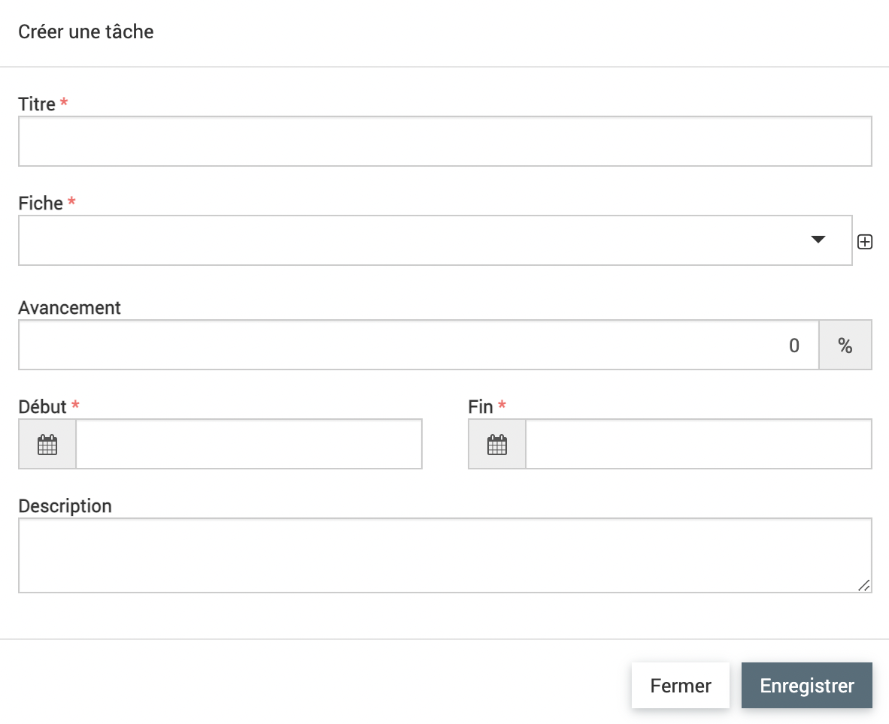

.. include:: ../substitutions.rst
Tâches
======

|suivi_projet| > |tâches|

Les tâches permettent de diviser le projet par personne et suivre l'avancée des différentes parties du projet.

Les fonctionnalités de tableau et d'ajout sont détaillées dans la partie :ref:`Fonctionnalités générales`.

Il y a un filtre par défaut lorsque l'on arrive sur les tâches : le tableau montre l'utilisateur connecté par défaut.

.. image:: images/Filtre_tache.png
  :width: 500

En cliquant sur le titre de la tâche, on accède aux détails.
Le **titre** de la tâche, le rattachement à la fiche et les dates de début et fin sont les champs obligatoires.

Par défaut, quand on créé une tâche dans le module tâche, elle est attribuée à l'utilisateur connecté. Pour attribuer une tâche à un autre utilisateur, il faut la rajouter depuis l'onglet Tâche des fiches.

La partie **Avancement** de la tâche n'a rien à voir avec l'onglet avancement dans les fiches.

On peut rattacher des **mots clés** aux tâches, la case "Tâche" doit être cochée dans le mot clé.

.. warning::
	La partie **mots clés** n'est pas clairement indiqué dans le formulaire des tâches mais les champs de mots clés se rajoutent à la fin du formulaire en dessous du champs *Description*.
