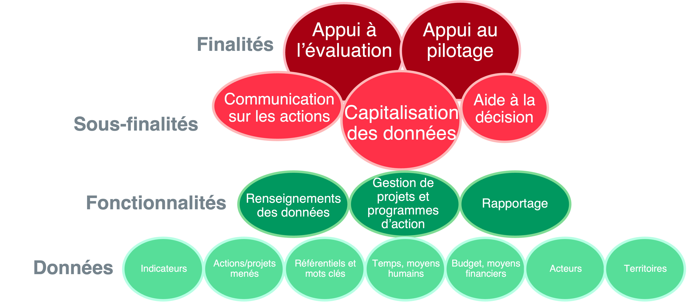
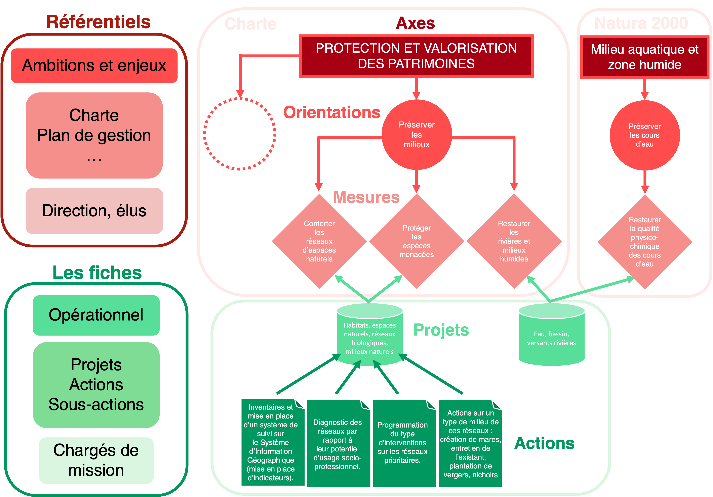

.. include:: ../substitutions.rst
Introduction
============

Cette documentation
~~~~~~~~~~~~~~~~~~~

.. warning::
   Cette documentation est toujours en cours de rédaction. Vous pouvez dès à présent proposer des modifications en m'envoyant un email (lroumazeilles[at]parcs-naturels-regionaux.fr)

Cette documentation a été élaborée pour pouvoir être utilisée par tous. Chaque parc et tête de réseau a un logiciel EVA personnalisé selon ces besoins donc certains point ne sont pas applicables pour tous.

**Comment utiliser cette documentation ?**

La table des matières est accessible sur la droite de l'écran et en cliquant sur le logo EVA en haut à gauche.

Vous pouvez rechercher un élément de documentation en particulier en cherchant par mots clés dans la barre de recherche à gauche sous le logo EVA.

Vous pouvez l'exporter au format pdf en cliquant en bas à gauche sur v:latest et dans téléchargement sur pdf ou epub.

Le logiciel EVA
~~~~~~~~~~~~~~~
Le logiciel EVA est un logiciel en ligne, utilisé par les Parcs Naturels Régionaux, les Parcs Nationaux et les Parcs Naturels Marins.

Le projet EVA est porté par la Fédération des Parcs Naturels Régionaux avec le soutien financier de l'Office Français de la Biodiversité.

.. image:: images/EVA_illus.png
   :width: 600

.. note::
   La note stratégique du logiciel EVA est accessible via ce `lien <https://fpnrf-my.sharepoint.com/:b:/g/personal/lroumazeilles_parcs-naturels-regionaux_fr/Efbp-hQNHmdGp7yXoB1vNpwBj5ehxqzVOIBI3A1evkJ9Mw?e=pINo6V>`_.
   
   Le code source du logiciel est disponible en Open Source sur la `plateforme GitLab <https://gitlab.com/logiciel-eva/logiciel-eva/>`_.

Finalités du logiciel
#####################

Les finalités premières du logiciel EVA sont un **appui à l’évaluation et au pilotage** qui passent nécessairement par la sous-finalité de **capitalisation des données** (diagramme 1). Le logiciel permet également de **communiquer sur les actions menées** et **d’aider à la décision**. Trois fonctionnalités principales permettent de répondre à ces finalités, ce sont les types d’action menées dans EVA :  le **renseignement des données**, la **gestion de projets** et le **rapportage**. Les types de données sont aussi détaillées dans le diagramme.

   Diagramme 1 : Un schéma permet de hiérarchiser la diversité des finalités et fonctionnalités

Définition du logiciel
######################

- **Définition  générale  :** EVA  est  un  logiciel  modulable  de  gestion  de  projet  adapté  aux aires protégées (PNR, PNx, PNM). EVA a été conçu pour faciliter l’évaluation de la mise en œuvre des chartes ou plans de  gestion des  parcs. Comme indiqué dans le diagramme précédent, à l’usage le logiciel EVA permet de piloter les chartes et plans de gestion et de capitaliser les données.
- **Définition pratique (cf. Diagramme 2) :** Les fiches projet/action sont le module central du logiciel EVA, elles recensent les informations nécessaires sur les activités menées par le parc. Un système de référentiels et de mots clés permet un classement des fiches. Les autres modules principaux vont permettre de renseigner différents types de données qui peuvent ensuite être rattachés aux fiches. Les  données  peuvent  concerner  des  données  de suivi du terrain avec les indicateurs mais également des données de suivi de la gestion, avec les actions menées et leurs moyens humains et financiers associés. Les données peuvent être insérées de trois façons : en remplissant des formulaire, par des imports de tableurs ou par des liaisons avec d’autres logiciels (cf. Liste des liaisons logiciels).  Les données peuvent être exportées sous différents formats (tableur ou texte). Un module d'analyse permet de réaliser des analyses simples et interactives dans le logiciel.  La  grande  capacité  de  personnalisation  du  logiciel  par  les  paramétrages  permet  de répondre  aux  spécificités  de  chaque  parc. 
- **Utilisateurs :** Les  utilisateurs  sont  les  chargés  de  mission  des  parcs  avec  un  rôle renforcé pour les référents EVA qui sont responsable de la mise en place et de l’animation du logiciel au sein de leur parc.

.. figure:: images/Diagramme_modules.png
   :width: 700

   Diagramme 2 : Représentation  du  logiciel  EVA,  montrant  les  modules  en  rouges  et  leur fonction.

Relation Fiches-Référentiels
############################

La concept de Fiches-Référentiels est au coeur du logiciel. 

**Les référentiels** concernent les ambitions et enjeux, ils font donc généralement référence à des documents comme les chartes et plans de gestion, ils concernent principalement les directeurs et élus qui suivent ces enjeux. 

**Les fiches** sont le côté opérationnel d’EVA, elles permettent de suivre les actions et sont à destination des chargés de mission qui les remplissent. 

Le référent EVA et la direction sont responsables de faire le lien entre ces deux univers pour que tout ce qui est remonté par les chargés de missions dans les fiches se retrouvent dans les bons enjeux et ambitions du référentiel initial. C’est la même logique avec les mots clés qui permettent d’appréhender/de classer les mêmes éléments dans plusieurs dimensions. 

La force du logiciel EVA est de pouvoir associer plusieurs référentiels à une même fiche, car certaines actions du parc peuvent contribuer à plusieurs finalités (mesure de la charte, Natura 2000...)

Liaisons avec d'autres logiciels
################################

- **AGE par Elap Finances :** outil comptable pour les Parc Nationaux. Une liaison à l’entrepôt de données donne accès aux données financières à j+1 par un accès en lecture seule.
- **.ICS calendrier en ligne :** liaison aux calendriers partagés en lecture seule via le protocole ICS. Elle  est  paramétrée pour  chaque  utilisateur  depuis  l'interface  EVA  et  fonctionne  pour OUTLOOK, ZIMBRA, Google Calendar, Phenix.
- **ZIMBRA  API-REST  serveur  ATEN  (OFB) :** solution  de  messagerie  et  de  calendrier  de  l'ATEN maintenue par l'OFB.
- **PostParc** : logiciel de gestion des contacts

Les liens utiles et ressources
~~~~~~~~~~~~~~~~~~~~~~~~~~~~~~

- Le code source du logiciel est disponible en Open Source sur la `plateforme GitLab <https://gitlab.com/logiciel-eva/logiciel-eva/>`_
- Le groupe collaboratif sur l'intranet de la Fédération : `Lien du groupe <https://www.parcs-naturels-regionaux.fr/espace-membres/groupes/projet-eva-referents-eva>`_
- L'assistance est disponible par le tchat en bas à droite de votre écran pour des besoins ponctuels ou des questions sur le fonctionnement |assistance|
- Pour remonter des anomalies ou des besoins plus complexes, il faut déposer un ticket, les tickets sont aussi accessibles sur GitLab. Il faut un compte et avoir rejoint le projet, la procédure est détaillée sur ce `document <https://fpnrf-my.sharepoint.com/:b:/g/personal/lroumazeilles_parcs-naturels-regionaux_fr/EViYOXP4pClEjkTjAU7px_8BJz_qI-OrnIAQjD4jpAz2uA?e=Eh80gZ>`_

