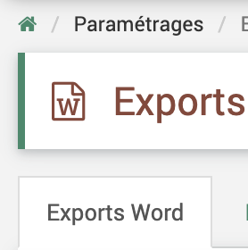
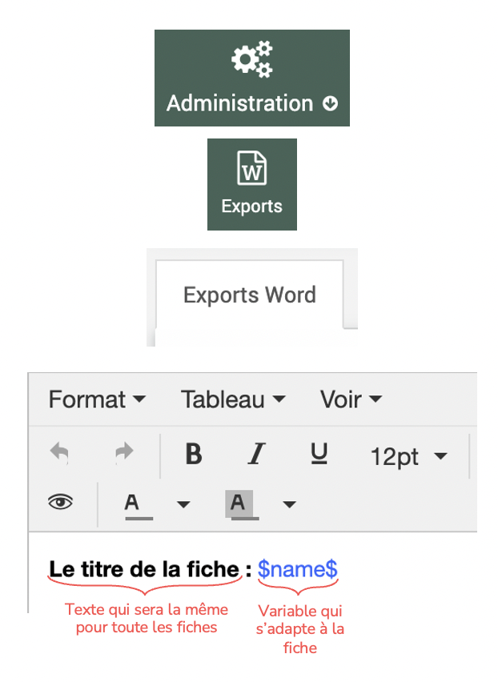
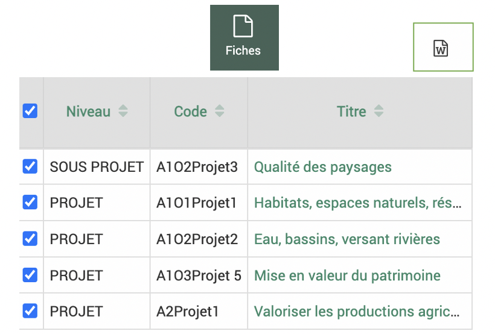
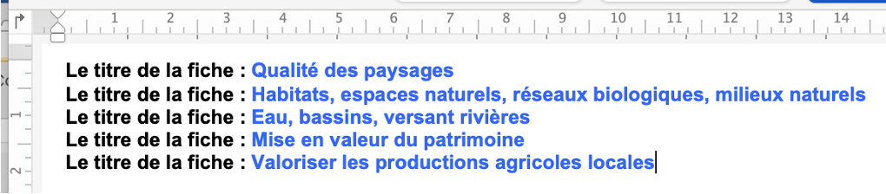
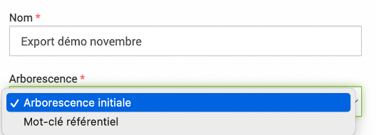
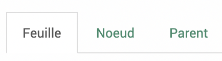
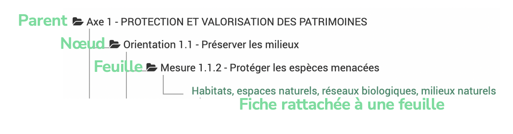
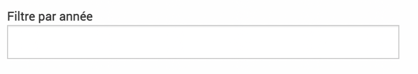
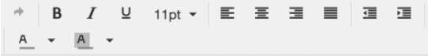

.. include:: ../substitutions.rst
Paramétrages avancés
====================

Exports Word
------------

|administration| > |exports|

**À quoi sert la fonctionnalité d'export Word dans EVA ?**

Pour exporter dans un format Word uniforme plusieurs fiches contenues dans le logiciel en un clic (ou presque…).
Exemples : Rapport d’activité, Programme d’action, Rapport d’évaluation…$

**Comment elle fonctionne ?**

Sur le principe du publipostage, les exports reposent sur la notion de "variable". 
Exemple : Les titres de toutes les fiches peuvent être appelées par la variable $name$. À l’export, pour chaque fiche, à la place de $name$ dans l’export, le titre de la fiche sera indiqué.

**Les étapes pour faire un export, exemple simple**

1. Paramétrage de l'export

Choisir le format et les champs à afficher (plus d'infos plus bas).

Les variables s'adaptent aux fiches exportées, les textes insérés sans variable seront toujours les mêmes pour toutes les fiches.

2. Choix des fiches à exporter

Dans le module des fiches, choisir les fiches à exporter et cliquer sur le logo Word en haut à droite.

3. Export

Exemple de fichier word rendu avec la variable titre qui s'est adapté à chaque fiche et le texte qui est resté le même.

Paramétrages des exports Word
-----------------------------

Les types d'export et leur vocabulaire
~~~~~~~~~~~~~~~~~~~~~~~~~~~~~~~~~~~~~~

Pour le paramétrage des exports, il existe deux types d'export défini dans le menu déroulant "Arborescence".

.. warning::
	Si on change ce paramètre d'arborescence de l'un à l'autre après avoir déjà paramétré l'export, tout s'efface. Il est donc plutôt conseillé d'en créer un nouveau si on souhaite changer l'arborescence.

**TYPE Arborescence initiale**

But : exporter plusieurs fiches les unes à la suite des autres sans ordre précis
Accessible depuis : tableau des fiches et les fiches elles-mêmes

Le vocabulaire Feuille - Noeud - Parent dans ce type d'export correspond au niveau des fiches exportées.

Le niveau "parent" correspond au plus haut niveau de fiche exportée, le niveau "feuille" au plus bas niveau et le niveau "noeud" à toutes les fiches de niveaux intermédiaires entre le plus élevé et le plus bas.

Le niveau ici fait référence au rattachement de la fiche, si la fiche n'est rattachée à aucune autre fiche, elle est par défaut une "feuille".

.. image:: images/niveau_export_simple.png
  :width: 600

.. note::
	L’export prend en compte cette arborescence uniquement si les fiches rattachées sont toutes dans l’export. Par exemple : Si on exporte uniquement la fiche SOUS-PROJET elle sera considéré comme une feuille car ces fiches enfants ou sa fiche parent ne sont pas intégrées

**TYPE Mot-clé référentiel**

But : exporter plusieurs fiches organisées selon l’arborescence d’un mot-clé ou référentiel
Accessible depuis : la vue arborescente des fiches |arbo_fiches|

Le vocabulaire Feuille - Noeud - Parent dans ce type d'export correspond au niveau du mot-clé ou référentiel exporté.

Le niveau "parent" correspond au plus haut niveau de mot-clé/référentiel, le niveau "feuille" au plus bas niveau et le niveau "noeud" à tous les niveaux intermédiaires entre le plus élevé et le plus bas. On peut donc paramétrer ces niveaux si on veut mettre en forme la partie de l'export contenant le mot-clé, par exemple son nom, exporter des données cumulées pour le mot-clé...

Les "fiches rattachées à", correspondent aux fiches rattachées à ce niveau de mot-clé et on pourra donc paramétrer l'export de la fiche comme dans le type précédent.

Option filtre par année
~~~~~~~~~~~~~~~~~~~~~~~

Cette option permet de filtrer les données sur une seule année (budget, mesures d'indicateurs...). Par exemple, si l'on suit un indicateur dans une fiche pluri-annuelle mais l'on souhaite faire ressortir dans cet export les mesures pour l'année 2023 uniquement, on peut indiquer 2023 dans ce champ.

Choix des variables
~~~~~~~~~~~~~~~~~~~

On peut choisir les variables à exporter dans les différents onglets disponibles à gauche du cadre de l'export. Les exports Word aujourd'hui concernent uniquement les fiches donc les variables disponibles concernent des données rattachées aux fiches.

En cliquant sur un élément à ajouter, il apparaîtra sous sa forme de variable dans le cadre à droite.

On peut rechercher un champ que l'on souhaite exporter dans la barre de recherche en haut des variables.

Lorsque l'on clique sur une variable, la question de l'arborescence est souvent posée. Cela veut dire de faire remonter les données de fiches rattachées par exemple ou d'afficher toute l'arborescence d'un mot-clé ou référentiel.

.. note::
  Pour les variables sous forme de tableau, il faut mieux éviter d'avoir trop de colonnes car le rendu devient alors illisible.

Mise en forme
~~~~~~~~~~~~~

On peut mettre en forme les exports grâce aux outils disponibles en haut du cadre de droite.

.. warning::
  Si on met en forme (gras, italique...) des éléments de texte dans les fiches, il ne faut pas mettre en forme des variables de textes dans l'export. Souvent lorsque les exports ne fonctionnent pas, c'est une question de superposition de la mise en forme fiches + exports. On peut alors aller dans la fiche, sélectionner les textes et cliquer sur "Effacer la mise en forme". |effacer_forme|

Image et vignette territoire
~~~~~~~~~~~~~~~~~~~~~~~~~~~~
On peut insérer des images et des vignettes représentant l'emprise du territoire tel qu'inséré dans EVA. Pour les images il faut d'abord l'ajouter en cliquant sur le +.

Quand on clique ensuite sur une image ou sur l'option "graphique" dans cartographie, la variable s'affiche dans le texte de l'export : 
| $territoriesMap(false)$ 
| $pictureGlobal(65)$
(65 ici représente l'identifiant de l'image inséré et sera donc différent en fonction de votre compte EVA)

On peut ensuite régler la taille en pixel en modifiant l'export comme ceci :
| $territoriesMap(false,500px,500px)$ 
| $pictureGlobal(65,500px,500px)$

Conseil !
~~~~~~~~~

TESTER PETIT À PETIT : N’attendez pas d’avoir fini votre export avant de le tester, tester le petit à petit (si une erreur survient vous pourrez identifier d’où elle vient). Faire des tests sur une fiche puis plusieurs fiches.

Deux cafés EVA sur les exports ont eu lieu en 2023 -> à regarder pour plus de détails (disponible dans le centre de ressources) :

- `Novembre 2023 Exports Word Exemples <https://fpnrf-my.sharepoint.com/:f:/g/personal/lroumazeilles_parcs-naturels-regionaux_fr/EsOr_di3mZJNhUULbvZ-7AcBrV_W7HTuep2FEIPv2CohXQ?e=siEalt>`_

- `Août 2023 Exports Word Référentiel <https://fpnrf-my.sharepoint.com/:v:/g/personal/lroumazeilles_parcs-naturels-regionaux_fr/EbATzDkwFrRFk5jF4eoAwR0BBzNc0EpM4bSIYbmfH_z0Wg?nav=eyJyZWZlcnJhbEluZm8iOnsicmVmZXJyYWxBcHAiOiJPbmVEcml2ZUZvckJ1c2luZXNzIiwicmVmZXJyYWxBcHBQbGF0Zm9ybSI6IldlYiIsInJlZmVycmFsTW9kZSI6InZpZXciLCJyZWZlcnJhbFZpZXciOiJNeUZpbGVzTGlua0NvcHkifX0&e=A4h3x0>`_

