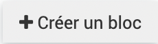

.. include:: ../substitutions.rst
Paramétrages simples
====================

Accueil
-------

Création des blocs
~~~~~~~~~~~~~~~~~~

Dans |administration| > |accueil|, on peut paramétrer l'écran d'accueil qui est l'écran qui s'affiche en premier par défaut lros de la connexion à EVA. Il est aussi accessible via le bouton |accueil_rouge|.

Il y a deux onglets dans le paramétrage de l'accueil : 

- un onglet "Accueil" qui peut être défini par chaque utilisateur

- un onglet "Accueil général" qui peut être défini par le référent EVA et s'affichera pour tous les utilisateurs

Les blocs définis dans l'accueil général s'afficheront au dessus des blocs définis par l'accueil.

Vous pouvez créer un bloc en cliqunt sur "Créer un bloc".

Un formulaire s'affiche avec plusieurs champs :

- Titre : il apparaîtra dans l'acceuil en titre du bloc

- Ordre : en partant de 0, le plus petit chiffre positionnera le bloc avant les autres, si deux blocs ont le même chiffre de position, ils se placeront dans l'ordre de création (le plus ancien d'abord)

- Largeur : combien de place le bloc prendra-t-il sur la page

- Type : en fonction du type choisi, plusieurs options sont proposées

	- Texte : Permet de faire passer des messages, de présenter EVA à l'arrivée sur le logiciel... On peut écrire le texte et le mettre en forme en html, on peut ajouter des images...
	- Liste : Pour ajouter une liste de fiches ou tâches avec une certaine requête, par exemple pour afficher dans l'accueil toutes les fiches d'un utilisateur qui sont en cours ou qui ont une date de caducité proche... La requête doit être définie dans les modules fiches ou tâches respectivement
	- Calendrier : Pour ajouter le calendrier avec une certaine requête donc par exemple toutes mes feuilles de temps uniquement, ou toutes les temps prévionnels de mon équipe uniquement... La requête doit être définie dans le module |temps| > |liste_temps|
	- Note : Pour afficher le fil de discussion par note sur les fiches, cela peut permettre de mettre en valeur des messages, les notes qui s'affichent sont uniquement celles des fiches pour lesquelles l'utilisateur est membre de l'équipe. (Il faut choisir note dans entité.
	- Graphique : il permet de montrer les temps passés par mois (Seule les feuilles de temps sont disponibles à ce jour avec une répartition par mois). On peut y associer une requête précise qui doit être défini dans le module |analyses|>|temps|

.. image:: images/Notes_accueil_ex.png
	:width: 300

Les requêtes intéressantes à paramétrer pour l'accueil sont celles basées sur "Utilisateur courant" car elles s'adapteront au profile de la personne connectée.

Exemples de mise en page d'accueil
~~~~~~~~~~~~~~~~~~~~~~~~~~~~~~~~~~

**Texte**

.. image:: images/Accueil_texte_ex.png
	:width: 300

**Liste**
Liste des fiches dont on est membre et qui arrive à caducité dans 30 jours.
Requête dans les fiches :

.. image:: images/Requete_accueil_ex.png
	:width: 300

**Calendrier**
Calendrier avec les personnes de mon équipe. Pour un meilleur rendu, il faut changer la couleur associée à chaque personne (`Indiqué ici <https://documentation-eva.readthedocs.io/fr/latest/Param%C3%A9trages-essentiels/index.html#creation-des-utilisateurs>`_)

Par exemple ici une nuance de bleu pour chaque personne :

.. image:: images/Calendrier_equipe_test.png
	:width: 600

Champs
------

Alertes
-------

Modèle de fiche
---------------