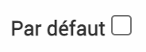

.. include:: ../substitutions.rst
Paramétrages simples
====================

Accueil
-------

Création des blocs
~~~~~~~~~~~~~~~~~~

Dans |administration| > |accueil|, on peut paramétrer l'écran d'accueil qui est l'écran qui s'affiche en premier par défaut lros de la connexion à EVA. Il est aussi accessible via le bouton |accueil_vert| en haut dans la barre verte.

Il y a deux onglets dans le paramétrage de l'accueil : 

- un onglet "Accueil" qui peut être défini par chaque utilisateur

- un onglet "Accueil général" qui peut être défini par le référent EVA et s'affichera pour tous les utilisateurs

Les blocs définis dans l'accueil général s'afficheront au dessus des blocs définis par l'accueil.

Vous pouvez créer un bloc en cliqunt sur "Créer un bloc".

Un formulaire s'affiche avec plusieurs champs :

- Titre : il apparaîtra dans l'acceuil en titre du bloc

- Ordre : en partant de 0, le plus petit chiffre positionnera le bloc avant les autres, si deux blocs ont le même chiffre de position, ils se placeront dans l'ordre de création (le plus ancien d'abord)

- Largeur : combien de place le bloc prendra-t-il sur la page

- Type : en fonction du type choisi, plusieurs options sont proposées

	- Texte : Permet de faire passer des messages, de présenter EVA à l'arrivée sur le logiciel... On peut écrire le texte et le mettre en forme en html, on peut ajouter des images...
	- Liste : Pour ajouter une liste de fiches ou tâches avec une certaine requête, par exemple pour afficher dans l'accueil toutes les fiches d'un utilisateur qui sont en cours ou qui ont une date de caducité proche... La requête doit être définie dans les modules fiches ou tâches respectivement
	- Calendrier : Pour ajouter le calendrier avec une certaine requête donc par exemple toutes mes feuilles de temps uniquement, ou toutes les temps prévionnels de mon équipe uniquement... La requête doit être définie dans le module |temps| > |liste_temps|
	- Note : Pour afficher le fil de discussion par note sur les fiches, cela peut permettre de mettre en valeur des messages, les notes qui s'affichent sont uniquement celles des fiches pour lesquelles l'utilisateur est membre de l'équipe. (Il faut choisir note dans entité.
	- Graphique : il permet de montrer les temps passés par mois ou par fiches. On peut y associer une requête précise qui doit être défini dans le module |analyses| > |temps|. **Pour les fiches, le graphique n'affiche que les temps prévus au niveau de la fiche parent.**

.. image:: images/Notes_accueil_ex.png
	:width: 300

Les requêtes intéressantes à paramétrer pour l'accueil sont celles basées sur "Utilisateur courant" car elles s'adapteront au profil de la personne connectée.

Exemples de mise en page d'accueil
~~~~~~~~~~~~~~~~~~~~~~~~~~~~~~~~~~

**Texte**

.. image:: images/Accueil_texte_ex.png
	:width: 45%
.. image:: images/Accueil_texte_ex2.png
	:width: 45%

*La mise en forme des textes est plus complexe et requiert des notions en html comme expliqué ci-dessous*

Pour mettre en forme les textes, il faut éditer la partie **Code Source** dans le bloc de texte.
En cliquant sur le bouton code source "<>" une autre page s'ouvre :

.. image:: images/Code_source.png
	:width: 100

Voici le code nécessaire pour faire apparaître le texte en rouge et en grand et les liens sous forme de texte cliquable comme sur l'exemple à droite au dessus :

| ``
&nbsp;<strong>Liens Utiles</strong>
``
| ``
&nbsp;
``
| ``
Plateforme des tickets pour notifier une anomalie : <a href="https://gitlab.com/logiciel-eva/logiciel-eva/-/issues">GitLab</a>
``
| ``
Groupe collaboratif des r&eacute;f&eacute;rents EVA : <a href="https://www.parcs-naturels-regionaux.fr/espace-membres/groupes/projet-eva-referents-eva">Groupe collaboratif</a>
``
| ``
&nbsp;
``

La partie ````.

**Liste**

Liste des fiches dont on est membre et qui arrive à caducité dans 30 jours.
Requête dans les fiches :

.. image:: images/Requete_accueil_ex.png
	:width: 300

**Calendrier**

Calendrier avec les personnes de mon équipe. Pour un meilleur rendu, il faut changer la couleur associée à chaque personne (`Indiqué ici <https://documentation-eva.readthedocs.io/fr/latest/Param%C3%A9trages-essentiels/index.html#creation-des-utilisateurs>`_)

Par exemple ici une couleur pour chaque personne, la requête associée prend les temps passés de 5 utilisateurs choisis :

.. image:: images/Calendrier_equipe_test.png
	:width: 600

**Temps par fiche**

Un graphique du temps par mois pour l'utilisateur courant, avec la requête suivante : 
- Filtres Utilisateurs : Utilisateur -> contient -> Utilisateur courant
- Filtres Fiches : Charte DEMO -> est rempli ->
- Filtres Feuilles de temps : Type -> contient -> Temps passé

.. image:: images/Accueil_temps_fiches.png
	:width: 600

Champs
------

Dans |administration| > |champs| on peut créer des champs personnalisés. Ces champs peuvent être ajoutés aux fiches, aux contacts ou aux structures et permettent de renseigner des informations qui n'auraient pas trouvé leur place ailleurs.

.. warning ::
	- Ces champs apparaissent souvent en bas de page après le bouton "Enregistrer" mais il faut bien se souvenir d'enregistrer à chaque fois, sinon les éléments ajoutés seront perdus.

	- Si un champ personnalisable a été rempli, il ne pourra pas être supprimer, par contre vous pouvez désactivez le groupe de champs (voir précision plus bas)

Fiche
~~~~~

Dans l'onglet Fiche, on peut créer un nouveau groupe de champs en appuyant sur "Créer un groupe de champs".

Le groupe sera créé tout en bas de la page si vous avez déjà des groupes de champs paramétrés.

Il faut insérer un titre, et un onglet de fiche ou le champ apparaîtra, on peut choisir à peu près tous les onglets, le champ aparaîtra en bas de page de l'onglet et dans l'ordre alphabétique avec les autres champs personnalisés. Si l'onglet n'est pas renseigné le champ apparaîtra par défaut dans l'onglet "champs personnalisables" des fiches.

.. warning ::
	Le paramètre "modèle de fiche" n'ajoute pas le champs comme "afficher" dans le modèle de fiche, il n'a donc pas grand intérêt, vous pouvez le laisser blanc.

Les onglets les plus utilisés si ce sont des champs textes (comme les bilans) sont l'onglet **Fiche** et l'onglet **Champs personnalisables** qui peut avoir un nom différent dans votre EVA.

Il faut ensuite cliquer sur enregistrer sur la droite |enregistrer_ligne|.

Le champ apparaît avec la case activé coché, cette case permet de rendre visible ou non le champ. Elle permet de cacher la visibilité de ce champ s'il n'est plus utilisé pour ne pas surcharger l'écran tout en gardant les informations associées.

Lorsqu'on survole le champ, trois outils apparaissent :

- |ajout_plus| permet d'ajouter les champs

- |modifier_ligne| permet de modifier le groupe de champs (titre, onglet...)

- |supprimer_ligne| permet de supprimer le groupe

**Ajout des champs**

Pour ajouter un champs un formulaire s'affiche avec les options suivantes, des options spécifique s'affichent en fonction du choix de type de champs :

- Titre : le titre du champ (obligatoire)

- Aide : l'aide apparaîtra sous la forme d'une infobulle

- Type:
	- Ligne de texte : champ pour un texte court. Avec ce type de champ on peut également cocher la case "Doit-il être unique ?"" Si cette case est cochée, le champ devra être unique, une erreur sera mentionné sinon et on ne pourra pas sauvegarder la fiche.
	- Bloc de texte : Pour un texte plus long, par exemple pour les bilans annuels
	- Sélection (radio) : Possibilité de sélectionner seulement une option (point à cocher)
	- Sélection multiple : Possibilité de sélectionner plusieurs options (case à cocher)
	- Sélection (liste) : Possibilité de sélectionner depuis un liste déroulante (une seule option possible)
	- Date : ajout d'un champ date (sélection sur un calendrier possible)
	- Date avec Heures : ajout d'un champ de date avec l'heures
	- Ajout d'un champ montant : un euros apparaît en bout de champs et il ne prend que les valeurs numériques

-> pour les sélections il faut ensuite crééer les valeurs en cliquant sur **Créer une valeur** en bas du formulaire 

On peut également choisir les options suivantes :

- Ordre : on peut choisir l'odre d'apparition dans le groupe de champ, 0 apparaîtra en premier.

- Placeholder : un texte qui apparait en grisé dans le cadre lorsqu'il est vide et disparait au remplissage. Cette option ne fonctionne pas pour les types sélections et montants.

- Obligatoire : la fiche ne peut pas être sauvegardée si le champ n'est pas rempli

.. warning::
	Ne pas cocher la case obligatoire pour l'instant car cela est trop contraignant et donnera une erreur dans d'autres modèles de fiche.

Exemple d'utilisation
~~~~~~~~~~~~~~~~~~~~~

**Bilans fiches pluriannuelles**
L'utilisation la plus répandue de ces champs est pour les bilans dans les fiches pluri-annuelles. En effet il arrive couramment qu'un même projet se déroule sur plusieurs années mais nécessite de faire un bilan chaque année. Dans ce cas on peut ajouter un groupe de champ Bilans dans l'onglet champs personnalisables de la fiche et des champs de type bloc de texte pour chaque année "Bilan 2020", "Bilan 2021"... On peut également ajouter un placeholder pour indiquer aux chargés de mission, la longueur et le format requis pour le bilan pour avoir un bilan assez homogénéiser au moment de l'export, car ces champs sont accssibles dans les exports word.

**Code temps**
Pour la synchronisation des temps, selon votre outil de calendrier les codes analytiques des fiches ne sont pas utilisables. Dans ce cas on peut utiliser des codes temps qui fonctionne comme les codes analytiques. C'est un champ de type Ligne de texte avec l'option "Doit-il être unique cochée". Vous verrez ensuite apparaître ce champ dans les options de synchronisation des calendriers pour le champ de jointure.

Contact
~~~~~~~

On peut également créer des champs personnalisables dans les contacts pour ajouter des informations par exemple ou valider le consentement à faire partie de la liste de contact.

L'ajout s'effectue selon les mêmes modalités que pour les fiches, à quelques exceptions.

On peut créer un nouveau groupe de champs en appuyant sur "Créer un groupe de champs".

Le groupe sera créé tout en bas de la page si vous avez déjà des groupes de champs paramétrés.

Il faut insérer un titre, (on peut indiquer un modèle de fiche mais ce paramètre n'a pas grand intérêt).

Il faut ensuite cliquer sur enregistrer sur la droite |enregistrer_ligne|.

Le champ apparaît avec la case activé coché, cette case permet de rendre visible ou non le champ. Elle permet de cacher la visibilité de ce champ s'il n'est plus utilisé pour ne pas surcharger l'écran tout en gardant les informations associées.

Lorsqu'on survole le champ, trois outils apparaissent :

- |ajout_plus| permet d'ajouter les champs

- |modifier_ligne| permet de modifier le groupe de champs (titre, onglet...)

- |supprimer_ligne| permet de supprimer le groupe

**Ajout des champs**

Pour ajouter un champs un formulaire s'affiche avec les options suivantes, des options spécifique s'affichent en fonction du choix de type de champs :

- Titre : le titre du champ (obligatoire)

- Aide : l'aide apparaîtra sous la forme d'une infobulle

- Type:
	- Ligne de texte : champ pour un texte court. Avec ce type de champ on peut également cocher la case "Doit-il être unique ?"" Si cette case est cochée, le champ devra être unique, une erreur sera mentionné sinon et on ne pourra pas sauvegarder la fiche.
	- Bloc de texte : Pour un texte plus long, par exemple pour les bilans annuels
	- Sélection (radio) : Possibilité de sélectionner seulement une option (point à cocher)
	- Sélection multiple : Possibilité de sélectionner plusieurs options (case à cocher)
	- Sélection (liste) : Possibilité de sélectionner depuis un liste déroulante (une seule option possible)
	- Date : ajout d'un champ date (sélection sur un calendrier possible)
	- Date avec Heures : ajout d'un champ de date avec l'heures
	- Ajout d'un champ montant : un euros apparaît en bout de champs et il ne prend que les valeurs numériques
	- Consentement : permet de faire apparaître un champ avec deux boutons "Confirmer" et "Supprimer" qui quand ils sont choisis font apparaître la date à laquelle ils ont été activés.

-> pour les sélections il faut ensuite crééer les valeurs en cliquant sur **Créer une valeur** en bas du formulaire 

On peut également choisir les options suivantes :

- Ordre : on peut choisir l'odre d'apparition dans le groupe de champ, 0 apparaîtra en premier.

- Placeholder : un texte qui apparait en grisé dans le cadre lorsqu'il est vide et disparait au remplissage. Cette option ne fonctionne pas pour les types sélections et montants.

- Obligatoire : la fiche ne peut pas être sauvegardée si le champ n'est pas rempli

**Exemple pour le champ consentement**

Pour confirmer si la personne a accepté de faire partie de la liste de diffusion d'une Newsletter par exemple ou a demandé à être retiré.

.. image:: images/Consentement_ex.png
	:width: 200

.. image:: images/Consentement_ex_conf.png
	:width: 200

Structure
~~~~~~~~~

On peut également créer des champs personnalisables dans les structures pour ajouter des informations par exemple.

L'ajout s'effectue selon les mêmes modalités que pour les contacts, sauf pour l'option consentement qui n'existe pas.

On peut créer un nouveau groupe de champs en appuyant sur "Créer un groupe de champs".

Le groupe sera créé tout en bas de la page si vous avez déjà des groupes de champs paramétrés.

Il faut insérer un titre (on peut indiquer un modèle de fiche mais ce paramètre n'a pas grand intérêt).

Il faut ensuite cliquer sur enregistrer sur la droite |enregistrer_ligne|.

Le champ apparaît avec la case activé coché, cette case permet de rendre visible ou non le champ. Elle permet de cacher la visibilité de ce champ s'il n'est plus utilisé pour ne pas surcharger l'écran tout en gardant les informations associées.

Lorsqu'on survole le champ, trois outils apparaissent :

- |ajout_plus| permet d'ajouter les champs

- |modifier_ligne| permet de modifier le groupe de champs (titre, onglet...)

- |supprimer_ligne| permet de supprimer le groupe

**Ajout des champs**

Pour ajouter un champs un formulaire s'affiche avec les options suivantes, des options spécifique s'affichent en fonction du choix de type de champs :

- Titre : le titre du champ (obligatoire)

- Aide : l'aide apparaîtra sous la forme d'une infobulle

- Type:
	- Ligne de texte : champ pour un texte court. Avec ce type de champ on peut également cocher la case "Doit-il être unique ?"" Si cette case est cochée, le champ devra être unique, une erreur sera mentionné sinon et on ne pourra pas sauvegarder la fiche.
	- Bloc de texte : Pour un texte plus long, par exemple pour les bilans annuels
	- Sélection (radio) : Possibilité de sélectionner seulement une option (point à cocher)
	- Sélection multiple : Possibilité de sélectionner plusieurs options (case à cocher)
	- Sélection (liste) : Possibilité de sélectionner depuis un liste déroulante (une seule option possible)
	- Date : ajout d'un champ date (sélection sur un calendrier possible)
	- Date avec Heures : ajout d'un champ de date avec l'heures
	- Ajout d'un champ montant : un euros apparaît en bout de champs et il ne prend que les valeurs numériques

-> pour les sélections il faut ensuite crééer les valeurs en cliquant sur **Créer une valeur** en bas du formulaire 

On peut également choisir les options suivantes :

- Ordre : on peut choisir l'odre d'apparition dans le groupe de champ, 0 apparaîtra en premier.

- Placeholder : un texte qui apparait en grisé dans le cadre lorsqu'il est vide et disparait au remplissage. Cette option ne fonctionne pas pour les types sélections et montants.

- Obligatoire : la fiche ne peut pas être sauvegardée si le champ n'est pas rempli

Alertes
-------

Dans le module |suivi_projet| > |alertes|, on peut paramétrer des alertes qui envoient des mails automatiquement. Ces mails permettent d'alerter sur des statuts de fiches, des dates de caducité, des modifications ou autre en fonction des paramétrages.

Les alertes sont basées sur les requêtes paramétrées dans le tableau des fiches.

En cliquant sur |bouton_3_traits|, on peut créer une nouvelle alerte. Les champs à remplir pour l'alerte sont les suivants :

- Nom : le titre de l'alerte

- Période d'envoi : journalier, hebdomadaire ou mensuel -> l'envoi s'effectue 3h du matin du jour concerné

- Requête : la requête à associer, elle est à définir auparavant dans les fiches (voir `Documentation requêtes <https://documentation-eva.readthedocs.io/fr/latest/Fonctionnalit%C3%A9s-g%C3%A9n%C3%A9rales/Tableaux.html#filtres-requetes-et-colonnes>`_)

- Destinataires : on peut choisir les destinataires en cochant les cases pour envoyer aux personnes rattachées aux fiches qui remontent de la requête : chef de projet, validateur, membre de l'équipe et/ou ajouter des destinataires en choisissant des utilisateurs en particulier.

- Objet : apparaîtra comme objet de mail

- Corps : on peut écrire un mail dans le cadre de texte et y ajouter quelques variables (disponibles sur la droite) comme la liste des projets qui remontent de la requête (sous forme de lien) et le nom et prénom du destinataire (ceux paramétrés dans le profil utilisateur).

.. Note::
	Si la requête ne remonte aucune fiche, le mail ne sera pas envoyé.

.. warning::
	La variable $projetCommissions$ ne fonctionne pas. L'oeil à côté des requêtes devraient envoyer vers le résultat de la requête mais il ne fonctionne pas.

Par exemple avec une requête sur les dates de caducité on peut envoyer des mails automatiques comme suit :

.. image:: images/Alertes_ex.png
	:width: 700

On peut **tester** l'envoi de l'alerte ou forcer son envoi en appuyant sur |envoi| en haut à droite, l'alerte s'envoi alors directement sans attendre la périodicité définie.

Pour des alertes utiles périodiquement, par exemple pour alerter sur la date proche d'un dossier à rendre tous les ans à la même date, on peut aussi **désactiver** les alertes en décochant la case activée.

.. note::
	On peut également modifier les destinaires et l'activation directement en mode tableau en cochant les cases, l'alerte s'enregistre automatiquement avec les modifications

.. warning::
	Si vous ne recevez pas les alertes automatiques, contactez l'assistance.

Modèle de fiche
---------------

Dans |administration| > |modele_fiches|, on peut paramétrer des modèles de fiches. Ces modèles sont utiles pour calibrer les champs à remplir dans les fiches. On peut créer plusieurs modèles de fiches pour des usages différents. Ils permettent de ne pas afficher les champs que l'on ne pense pas utile pour notre usage pour ne pas surcharger l'écran pour les utilisateurs et leur simplifier le remplissage. Ils permettent également d'afficher des champs supplémentaires (texte, case à cocher...) qui sont spécifiques à certains usages.

Si aucun modèle de fiche n'est défini, un modèle par défaut est proposé avec tous les champs affichés.

Un modèle de fiche peut être ajouté via |bouton_3_traits|, le formulaire permet de lui donner un nom puis de choisir les champs à afficher qui sont diviser en trois onglets : "Champs", "Champs personnalisables", "Mots-clés" .

.. note::
	Par défaut les champs sont masqués, donc il faut changer pour afficher en dessous des champs que l'on souhaite afficher, si le champs est laissé blanc il sera masqué.

**Onglet Champs**

Voici les différents champs accessibles et les questions à se poser si l'on souhaite les afficher ou non (les fonctionnalités de ces champs sont définis dans la `partie fiche de la documentation <https://documentation-eva.readthedocs.io/fr/latest/Fonctionnalit%C3%A9s-par-modules/Fiches.html#remplir-une-fiche>`_) :

- Code : obligatoire ou presque, c’est un code unique qui permet de rattacher d’autres informations à la fiche, il est recommandé d'utiliser ces codes et donc de les afficher

- Rattachement arborescence initiale : est-ce que je souhaite faire le lien entre des projets et des sous-actions ?

- Champs textes : Descriptif, Bilan, Objectifs, Livrables, Contexte et motif -> Est-ce que j'ai besoin de tous ces champs ?

- Chef.fe(s) de projet : est-ce que ce rôle a du sens dans mon parc ?

- Validateur(s) : est-ce que ce rôle a du sens dans mon parc ?

- Statut : est-ce que je souhaite afficher des informations sur le statut de la fiche ? Brouillon ou à valider par exemple, peut permettre de solliciter automatiquement pas mail les chefs de projets et validateurs

- Date de programmation : est-ce que cette date a du sens pour moi, est-ce qu’elle est redondante ?

- Date de démarrage prévue : est-ce que cette date a du sens pour moi, est-ce qu’elle est redondante ?

- Date de fin prévue : est-ce que cette date a du sens pour moi, est-ce qu’elle est redondante ?

- Date de démarrage effective : est-ce que cette date a du sens pour moi, est-ce qu’elle est redondante ?

- Date de fin effective : est-ce que cette date a du sens pour moi, est-ce qu’elle est redondante ?

- Maîtrise d'ouvrage externe : est-ce que certains de mes projets sont en maîtrise d’ouvrage externe ?

- Accessible au réseau : est-ce que je souhaite laisser la possibilité de faire remonter les informations de cette fiche au réseau ?

- Maître d'ouvrage : à remplir si on a cocher la case au-dessus maîtrise d'ouvrage externe

- Statut financier : est-ce que j’ai besoin d’associer des statuts financiers qui sont capable de verrouiller l’onglet budget et qui peuvent être utile pour des requêtes ?

- Codes financiers : Est-ce qu’on peut avoir des fiches pluriannuelles avec un suivi budgétaire pour chaque année ?

- Temps prévu : est-ce que je souhaite définir un temps total prévu pour la fiche ? (servira dans la synthèse dans l’onglet temps de la fiche)

.. warning::
	"Membres de l'équipe" cette option masquer ou non n'a pas d'incidence, tout comme "Acteurs" et "Avancement"

**Onglet Champs personnalisables**

Ici vous trouverz les champs en plus qui ont été définis dans |administration| > |champs| (voir la `documentation <https://documentation-eva.readthedocs.io/fr/latest/Param%C3%A9trages-simples/index.html#champs>`_ à ce sujet).

Peut-importe l'onglet auquel il a été rattaché, le champ apparaîtra ici dans champs personnalisables.

**Onglet Mots-clés**

Ici l'onglet mots-clés désignent aussi bien les référentiels que les mots-clés. Les mots-clés retrouvés ici sont uniquement les mots-clés que l'on a rattaché aux fiches.
Pour l'affichage de ces mots-clés et référentiel on peut se demander quelles clés d’analyse on souhaite privilégier, quel rattachement on souhaite associer à ce modèle de fiche.

.. warning::
	Lorsqu'un nouveau mots-clés ou référentiels est créé il va apparaître dans toutes les fiches sous tous les modèles de fiche qui ont été créé en amont. Il suffit de réenregistrer les modèles de fiche pour que le mot-clé ou référentiel passe en "Masquer" par défaut. Si on veut qu'il soit en "Afficher" il vaut mieux aller le paramétrer dans le modèle de fiche dès la création du mot-clé ou référentiel.

**Par défaut**

En cochant la case "Par défaut", on peut choisir de définir un modèle de fiche par défaut qui sera donc proposé par défaut lors de la création d'une fiche. Cette case se trouve en haut du formulaire mais on peut également le cocher via le tableau des modèles de fiche.

.. note::
	Si on choisit de masquer un champ pour lequel des informations avaient été rempli, on ne perd pas les informations, elles sont simplement cachées. Si l'on ré-affiche ce champs par la suite, les informations réapparaitront.

